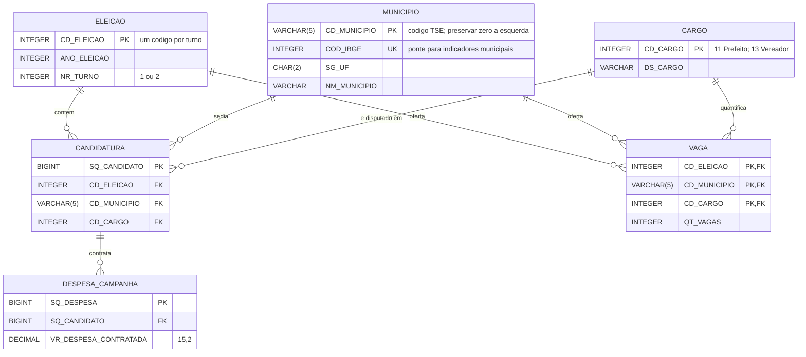
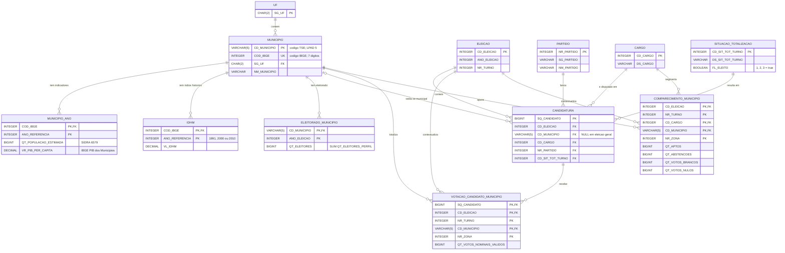

# DER — questões de Davi

Este arquivo detalha, em ordem, as três perguntas atribuídas ao Davi no
[`estrategia.md`](estrategia.md): Q1, Q2 e Q3.

---

## Q1 — quanto custa uma cadeira?

Para esta pergunta, **custo de uma cadeira** é o total de despesas contratadas por
todas as candidaturas de uma disputa dividido pela quantidade de vagas dessa
disputa. Uma disputa é identificada por eleição × município × cargo. Portanto, o
cálculo não é uma média apenas entre os eleitos:

```text
custo_por_cadeira = SUM(vr_despesa_contratada) / qt_vagas
```

O resultado pode ser comparado entre municípios, cargos e anos. A análise nacional
é formada pelas disputas de todos os municípios, mas o cálculo continua separado
por disputa; somar despesas e vagas de granularidades diferentes produziria uma
razão sem significado.



### Cardinalidades

| Relação | Cardinalidade | Justificativa |
| --- | --- | --- |
| `ELEICAO` – `CANDIDATURA` | 1:N | uma eleição contém várias candidaturas |
| `MUNICIPIO` – `CANDIDATURA` | 1:N | no recorte municipal, cada candidatura disputa em um município |
| `CARGO` – `CANDIDATURA` | 1:N | várias candidaturas concorrem ao mesmo cargo |
| `CANDIDATURA` – `DESPESA_CAMPANHA` | 1:N | uma candidatura pode contratar nenhuma ou várias despesas |
| `ELEICAO` – `VAGA` | 1:N | cada eleição publica vagas para várias disputas |
| `MUNICIPIO` – `VAGA` | 1:N | um município oferece vagas para mais de um cargo e ano |
| `CARGO` – `VAGA` | 1:N | o mesmo cargo tem quantidades de vagas em vários municípios e eleições |

### Observações de modelagem e cálculo

- `VAGA` vem de `consulta_vagas`. Em 2016 o campo bruto é `QT_VAGAS`; de 2018 em
  diante é `QT_VAGA`. Ambos são normalizados para `qt_vagas` na carga.
- O join deve usar as três chaves da disputa: `CD_ELEICAO`, `CD_MUNICIPIO` e
  `CD_CARGO`. Juntar só por ano ou município mistura Prefeito com Vereador e pode
  multiplicar despesas.
- Primeiro se soma `VR_DESPESA_CONTRATADA` por candidatura; depois por disputa; só
  então se divide por `QT_VAGAS`. Candidatura sem despesa registrada entra como
  zero por meio de `LEFT JOIN` a partir de `CANDIDATURA`.
- `SQ_DESPESA` só funciona como PK depois de filtrar a prestação Final e remover
  valores `-1`/nulos, conforme a regra já registrada na Q2.
- O modelo acima cobre eleições **municipais**, nas quais `SG_UE` identifica o
  município. Em eleições gerais `SG_UE` é UF ou `BR`; não se deve fingir que é um
  código municipal. Para comparar cargos estaduais/federais seria necessária uma
  entidade mais geral `UNIDADE_ELEITORAL`.

---

## Q2 — taxa de sucesso × patrimônio declarado

Leitura (pé-de-galinha): `||` exatamente um, `o{` zero ou muitos. Todas as FKs da
Q2 são `NOT NULL`, então todo lado "1" é obrigatório. `BEM_CANDIDATO` e
`PAGAMENTO_DESPESA` são entidades propostas (não estão no `der.md` do repositório).
`CARGO` aparece só pela chave porque o dicionário ainda não a descreve.


## Cardinalidades

| Relação | Cardinalidade | Justificativa (dicionário) |
| --- | --- | --- |
| `POLITICO` – `CANDIDATURA` | 1:N | uma pessoa, várias candidaturas ao longo dos anos; `ID_POLITICO` NOT NULL |
| `ELEICAO` – `CANDIDATURA` | 1:N | cada turno tem seu `CD_ELEICAO`; candidato de 2º turno = duas candidaturas |
| `MUNICIPIO` – `CANDIDATURA` | 1:N | `CD_MUNICIPIO` NOT NULL (recorte é eleição municipal) |
| `CARGO` – `CANDIDATURA` | 1:N | `CD_CARGO` NOT NULL |
| `SITUACAO_TOTALIZACAO` – `CANDIDATURA` | 1:N | `CD_SIT_TOT_TURNO` NOT NULL |
| `UF` – `MUNICIPIO` | 1:N | `SG_UF` NOT NULL |
| `CANDIDATURA` – `VOTACAO_CANDIDATO_MUNICIPIO` | 1:N | uma linha por candidato × turno × município × zona |
| `MUNICIPIO` – `VOTACAO_CANDIDATO_MUNICIPIO` | 1:N | `CD_MUNICIPIO` na PK composta |
| `CANDIDATURA` – `BEM_CANDIDATO` | 1:N | uma linha por bem; zero linhas = patrimônio zero |
| `CANDIDATURA` – `RECEITA_CAMPANHA` | 1:N | uma linha por receita declarada |
| `CANDIDATURA` – `DESPESA_CAMPANHA` | 1:N | uma linha por despesa contratada |
| `DESPESA_CAMPANHA` – `PAGAMENTO_DESPESA` | 1:N | uma despesa contratada pode ter vários pagamentos |

## Observações de modelagem

- `DECIMAL` nos atributos de valor é `DECIMAL(15,2)`; a precisão foi para o
  comentário porque a notação Mermaid não aceita vírgula no tipo.
- `SQ_RECEITA` e `SQ_DESPESA` são PK no dicionário mas aceitam `-1`/nulo e
  repetem entre entregas Parcial/Final. Na carga: filtrar `TP_PRESTACAO_CONTAS =
  'Final'` e descartar `-1`; só então a PK vale.
- `PAGAMENTO_DESPESA` tem PK composta `(SQ_DESPESA, SQ_PARCELAMENTO_DESPESA)`; o
  dicionário cita `SQ_PARCELAMENTO_DESPESA` só na coluna Chave, por isso ele
  aparece no diagrama sem tipo confirmado (assumido `INTEGER`).
- `CD_MUNICIPIO` é `VARCHAR(5)` com zero à esquerda nos dois lados
  (`LPAD(…, 5, '0')`), senão o join votação × prestação de contas perde linhas.

---

## Q3 — índices municipais × eleitos e partidos vitoriosos

Pergunta recebida: “Quais os índices de dado município (PIB per capita, IDHM,
eleitores por população total, isentos = votos brancos + nulos + abstenções) com
relação aos eleitos/partidos mais vitoriosos?”

O grão de análise é **município × eleição × cargo × turno**. `MUNICIPIO` faz a
ponte entre o código TSE, usado nos resultados eleitorais, e o código IBGE, usado
nos indicadores socioeconômicos.



### Cardinalidades

| Relação | Cardinalidade | Justificativa |
| --- | --- | --- |
| `UF` – `MUNICIPIO` | 1:N | uma UF contém vários municípios |
| `MUNICIPIO` – `MUNICIPIO_ANO` | 1:N | população e PIB variam por município e ano |
| `MUNICIPIO` – `IDHM` | 1:N | há uma observação por Censo disponível |
| `MUNICIPIO` – `ELEITORADO_MUNICIPIO` | 1:N | o total de eleitores muda a cada ano eleitoral |
| `MUNICIPIO` – `CANDIDATURA` | 1:N opcional | identifica a disputa local em eleição municipal; é nulo em eleição geral |
| `PARTIDO` – `CANDIDATURA` | 1:N | um partido lança várias candidaturas |
| `SITUACAO_TOTALIZACAO` – `CANDIDATURA` | 1:N | a situação identifica quais candidaturas foram eleitas |
| `CANDIDATURA` – `VOTACAO_CANDIDATO_MUNICIPIO` | 1:N | os votos de uma candidatura são distribuídos por município e zona |
| `MUNICIPIO` – `VOTACAO_CANDIDATO_MUNICIPIO` | 1:N | cada município totaliza votos de vários candidatos |
| `MUNICIPIO` – `COMPARECIMENTO_MUNICIPIO` | 1:N | a apuração é separada por eleição, cargo, turno e zona |

### Indicadores derivados

| Indicador | Cálculo no grão municipal | Observação |
| --- | --- | --- |
| PIB per capita | `vr_pib_per_capita` | usar o ano disponível mais próximo, sem ultrapassar o ano da eleição |
| IDHM | `vl_idhm` | para município, o último valor disponível é o do Censo 2010 |
| eleitores / população | `qt_eleitores / qt_populacao_estimada` | numerador e denominador precisam representar o mesmo ano |
| “isentos” | `(SUM(qt_votos_brancos) + SUM(qt_votos_nulos) + SUM(qt_abstencoes)) / SUM(qt_aptos)` | calcular dentro do mesmo cargo e turno |
| votos do partido | `SUM(qt_votos_nominais_validos)` agrupado por `nr_partido` | o partido do voto vem da candidatura |
| vitórias do partido | `COUNT(DISTINCT sq_candidato)` onde `fl_eleito = true` | ranquear dentro da mesma eleição e cargo |

### Observações de modelagem e cálculo

- `ELEITORADO_MUNICIPIO` é uma tabela agregada para esta pergunta. Sua quantidade
  vem de `SUM(QT_ELEITORES_PERFIL)` do `perfil_eleitorado`, eliminando as dimensões
  de gênero, faixa etária, escolaridade etc. antes do join.
- `COMPARECIMENTO_MUNICIPIO` e `VOTACAO_CANDIDATO_MUNICIPIO` aparecem no grão bruto
  município × zona. Para a análise municipal, somar as zonas primeiro. Nunca juntar
  as duas tabelas ainda no grão bruto: isso cria produto cartesiano entre candidatos
  e linhas de comparecimento e infla votos e eleitores.
- A soma de brancos, nulos e abstenções é chamada de **“isentos” apenas para manter
  o vocabulário da pergunta**. Tecnicamente, ela representa votos não válidos mais
  não comparecimento; não são eleitores legalmente isentos de votar.
- `QT_APTOS`, brancos, nulos e abstenções se repetem por cargo. O índice deve ser
  calculado separadamente por cargo (por exemplo, Prefeito) ou usando um único cargo
  representativo; somar Prefeito e Vereador duplica o eleitorado.
- O IDHM municipal é do Atlas Brasil e só existe para 1991, 2000 e 2010. Ele deve
  aparecer com `ano_referencia` no resultado; não pode ser rotulado como IDHM de
  2020 ou 2024.
- PIB per capita e população têm calendários distintos. Para evitar olhar o futuro,
  associe à eleição o dado mais recente cujo `ano_referencia <= ano_eleicao`.
- “Partido mais vitorioso” precisa de critério explícito. Para cadeiras conquistadas,
  use a contagem de candidaturas com `FL_ELEITO = true` e o município da disputa;
  esse ranking local só existe diretamente nas eleições municipais. Para preferência
  eleitoral local, inclusive em eleições gerais, use a soma dos votos no município.
  São rankings diferentes e ambos podem ser relacionados aos quatro índices.
