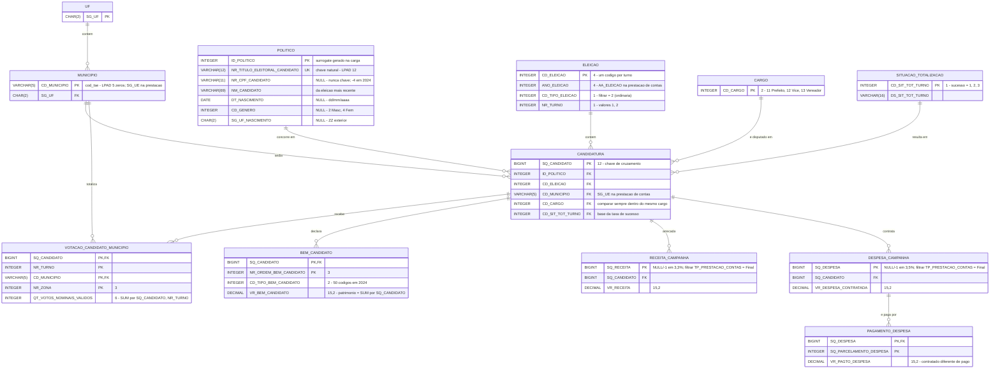

# DER — Q2: taxa de sucesso × patrimônio declarado

Leitura (pé-de-galinha): `||` exatamente um, `o{` zero ou muitos. Todas as FKs da
Q2 são `NOT NULL`, então todo lado "1" é obrigatório. `BEM_CANDIDATO` e
`PAGAMENTO_DESPESA` são entidades propostas (não estão no `der.md` do repositório).
`CARGO` aparece só pela chave porque o dicionário ainda não a descreve.

## Cardinalidades

| Relação | Cardinalidade | Justificativa (dicionário) |
| --- | --- | --- |
| `POLITICO` – `CANDIDATURA` | 1:N | uma pessoa, várias candidaturas ao longo dos anos; `ID_POLITICO` NOT NULL |
| `ELEICAO` – `CANDIDATURA` | 1:N | cada turno tem seu `CD_ELEICAO`; candidato de 2º turno = duas candidaturas |
| `MUNICIPIO` – `CANDIDATURA` | 1:N | `CD_MUNICIPIO` NOT NULL (recorte é eleição municipal) |
| `CARGO` – `CANDIDATURA` | 1:N | `CD_CARGO` NOT NULL |
| `SITUACAO_TOTALIZACAO` – `CANDIDATURA` | 1:N | `CD_SIT_TOT_TURNO` NOT NULL |
| `UF` – `MUNICIPIO` | 1:N | `SG_UF` NOT NULL |
| `CANDIDATURA` – `VOTACAO_CANDIDATO_MUNICIPIO` | 1:N | uma linha por candidato × turno × município × zona |
| `MUNICIPIO` – `VOTACAO_CANDIDATO_MUNICIPIO` | 1:N | `CD_MUNICIPIO` na PK composta |
| `CANDIDATURA` – `BEM_CANDIDATO` | 1:N | uma linha por bem; zero linhas = patrimônio zero |
| `CANDIDATURA` – `RECEITA_CAMPANHA` | 1:N | uma linha por receita declarada |
| `CANDIDATURA` – `DESPESA_CAMPANHA` | 1:N | uma linha por despesa contratada |
| `DESPESA_CAMPANHA` – `PAGAMENTO_DESPESA` | 1:N | uma despesa contratada pode ter vários pagamentos |

## Observações de modelagem

- `DECIMAL` nos atributos de valor é `DECIMAL(15,2)`; a precisão foi para o
  comentário porque a notação Mermaid não aceita vírgula no tipo.
- `SQ_RECEITA` e `SQ_DESPESA` são PK no dicionário mas aceitam `-1`/nulo e
  repetem entre entregas Parcial/Final. Na carga: filtrar `TP_PRESTACAO_CONTAS =
  'Final'` e descartar `-1`; só então a PK vale.
- `PAGAMENTO_DESPESA` tem PK composta `(SQ_DESPESA, SQ_PARCELAMENTO_DESPESA)`; o
  dicionário cita `SQ_PARCELAMENTO_DESPESA` só na coluna Chave, por isso ele
  aparece no diagrama sem tipo confirmado (assumido `INTEGER`).
- `CD_MUNICIPIO` é `VARCHAR(5)` com zero à esquerda nos dois lados
  (`LPAD(…, 5, '0')`), senão o join votação × prestação de contas perde linhas.
