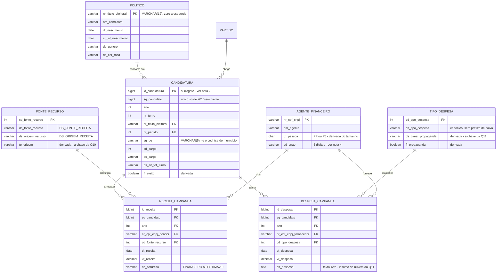

# DER — módulo do Enrico (Q10, Q11, Q12)

Prestação de contas + linha do tempo do político. Este é o módulo que os outros
três consomem: a prestação de contas alimenta a Q1 e a Q2 do Davi e a Q8 da Duda.

Chaves compartilhadas conforme o contrato da seção 3 do
[`estrategia.md`](estrategia.md). Implementação em [`../sql/`](../sql/).

## Diagrama

## As cinco notas que o diagrama não cabe

### 1. `POLITICO` é chaveado por título de eleitor, nunca por CPF

Em 2024 o TSE suprimiu o CPF: as 463.859 linhas trazem `NR_CPF_CANDIDATO = '-4'`,
código de dado protegido (LGPD). A coluna **não fica vazia**, fica com um valor —
então uma checagem de nulo passa, o `GROUP BY` roda e a eleição municipal inteira
vira uma pessoa só. O título está preenchido em todos os anos (pior caso 1,76% de
ruim, em 2002) e tem 12 dígitos em todos eles.

### 2. 🚨 `sq_candidato` não é chave antes de 2010 — achado novo

O contrato declara `candidatura.sq_candidato BIGINT` como chave. **Isso vale de
2010 em diante, não antes.** Medido sobre os arquivos baixados:

| ano | linhas | (sq, turno) distintos | colisões |
|---|---|---|---|
| 2002 | 18.109 | 5.169 | 12.940 |
| 2004 | 402.157 | **1.506** | 400.651 |
| 2006 | 19.303 | 3.205 | 16.098 |
| 2008 | 382.079 | 68.683 | 313.396 |
| 2010 | 22.577 | 22.577 | 0 |
| 2012 | 483.741 | 483.650 | 91 |
| 2014–2026 | — | — | **0** |

Até 2008 o campo tem de 1 a 5 dígitos e é um contador por unidade eleitoral, não
um identificador de candidato: **`SQ_CANDIDATO = 62` aparece em quatro anos com
2.004 títulos de eleitor diferentes.** De 2010 em diante passa a ter 11–12 dígitos
e fica único.

O efeito é silencioso e destrutivo: deduplicar por `sq_candidato` funde 402 mil
candidaturas de 2004 em 1.506 registros, sem erro nenhum — só com o número final
errado. Foi exatamente o que aconteceu no primeiro rascunho deste módulo, e só
apareceu porque o total de políticos não bateu com o do `estrategia.md`.

**Solução adotada:** `CANDIDATURA` ganha uma PK substituta (`id_candidatura`), e a
chave natural que vale em todos os anos é
`(ano, sg_ue, cd_cargo, nr_turno, sq_candidato)`.

**Para o Davi e a Duda isso não muda nada:** a prestação de contas começa em 2014,
onde o `sq_candidato` é único. O join do contrato continua válido no escopo de
vocês. O problema só existe antes de 2010, que é território da Q12.

### 3. `CANDIDATURA` não tem coluna de município

O vínculo é por `SG_UE`, que em eleição municipal **é** o código TSE do município
(`VARCHAR(5)`, com zero à esquerda). É a FK para `MUNICIPIO.cod_tse` do módulo do
Davi.

⚠️ E não junte `nm_ue` por `sg_ue` para obter o nome: o par é 1-para-muitos, com
5.597 unidades eleitorais gerando 8.070 pares, porque a grafia do nome muda entre
anos. Um `LEFT JOIN` assim multiplica linhas em silêncio — na Q12 fez a
reincidência saltar de 32,3% para 61,2% e criou políticos com 26 eleições numa
série de 13. O nome do município vem de `MUNICIPIO`.

### 4. `AGENTE_FINANCEIRO` é doador e fornecedor na mesma entidade

A mesma gráfica que fornece material impresso pode ter doado em outro ano. A
chave é o CPF/CNPJ só com dígitos; `tp_pessoa` sai do tamanho (11 = PF, 14 = PJ),
porque a fonte não traz o tipo em todos os anos.

O CNAE vem normalizado em **5 dígitos**: o leiaute antigo traz a subclasse de 7
(`9492800`) e o novo a classe de 5 (`94928`). Sem normalizar, o mesmo setor vira
dois.

### 5. Atributos derivados — o professor vai perguntar

| Atributo | De onde sai |
|---|---|
| `fl_eleito` | `DS_SIT_TOT_TURNO` ∈ {ELEITO, ELEITO POR QP, ELEITO POR MÉDIA, MÉDIA}. `2º TURNO` **não** é eleito. |
| `tp_origem` | par (`ds_fonte`, `ds_origem`) — critério em [`q10-publico-privado.md`](q10-publico-privado.md) |
| `ds_canal_propaganda` | `ds_tipo_despesa` normalizado — critério em [`q11-propaganda.md`](q11-propaganda.md) |
| `tp_pessoa` | tamanho do CPF/CNPJ |
| `pc_publico` | `vr_publico / vr_total` |

## Caminho de joins de cada pergunta

| Q | Caminho | Saltos |
|---|---|---|
| **Q10** | `CANDIDATURA` → `RECEITA_CAMPANHA` → `FONTE_RECURSO.tp_origem`, agrupado por `fl_eleito` | 2 |
| **Q11** | `CANDIDATURA` → `DESPESA_CAMPANHA` → `TIPO_DESPESA.ds_canal_propaganda` + `AGENTE_FINANCEIRO.cd_cnae` + texto livre de `ds_despesa` | 2 |
| **Q12** | `POLITICO` → `CANDIDATURA` (todas as eleições de 2002 a 2026) | 1 |
