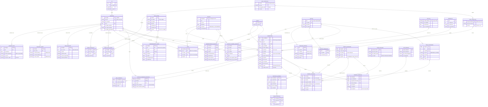

```mermaid
erDiagram
    %% ===== TERRITORIO E CONTEXTO =====
    UF                 ||--o{ MUNICIPIO                   : contem
    MUNICIPIO          ||--o{ MUNICIPIO_ANO               : "indicador anual"
    MUNICIPIO          ||--o{ MUNICIPIO_CENSO             : "indicador do censo"
    MUNICIPIO          ||--o{ IDHM_MUNICIPIO              : "idhm ate 2010"
    MUNICIPIO          ||--o{ CENSO_INSTRUCAO             : escolaridade
    NIVEL_INSTRUCAO    ||--o{ CENSO_INSTRUCAO             : classifica
    NIVEL_INSTRUCAO    |o--o{ GRAU_INSTRUCAO              : agrupa
    MUNICIPIO          ||--o{ CENSO_FAIXA_ETARIA          : "idade da populacao"
    FAIXA_ETARIA       ||--o{ CENSO_FAIXA_ETARIA          : classifica
    MUNICIPIO          ||--o{ COMPARECIMENTO_PERFIL       : "abstencao por idade"
    FAIXA_ETARIA       ||--o{ COMPARECIMENTO_PERFIL       : classifica

    %% ===== ELEICAO, PARTIDO E CANDIDATURA =====
    ELEICAO            ||--o{ CANDIDATURA                 : contem
    CARGO              ||--o{ CANDIDATURA                 : disputa
    PARTIDO            ||--o{ CANDIDATURA                 : lanca
    POLITICO           ||--o{ CANDIDATURA                 : "concorre em"
    GRAU_INSTRUCAO     ||--o{ CANDIDATURA                 : declara
    MUNICIPIO          |o--o{ CANDIDATURA                 : "sedia se municipal"
    PARTIDO            ||--o| ESPECTRO_PARTIDO            : "classificado como"
    PARTIDO            ||--o| PARTIDO_FEDERACAO           : integra
    FEDERACAO          ||--|{ PARTIDO_FEDERACAO           : agrega
    CANDIDATURA        ||--o{ BEM_CANDIDATO               : declara

    %% ===== RESULTADOS =====
    ELEICAO            ||--o{ VAGA                        : oferta
    CARGO              ||--o{ VAGA                        : "cadeiras de"
    MUNICIPIO          |o--o{ VAGA                        : "se municipal"
    CANDIDATURA        ||--o{ VOTACAO_CANDIDATO_MUNICIPIO : "recebe votos"
    MUNICIPIO          ||--o{ VOTACAO_CANDIDATO_MUNICIPIO : apura
    ELEICAO            ||--o{ VOTACAO_LEGENDA_MUNICIPIO   : apura
    PARTIDO            ||--o{ VOTACAO_LEGENDA_MUNICIPIO   : "recebe legenda"
    MUNICIPIO          ||--o{ VOTACAO_LEGENDA_MUNICIPIO   : apura
    ELEICAO            ||--o{ COMPARECIMENTO_MUNICIPIO    : apura
    CARGO              ||--o{ COMPARECIMENTO_MUNICIPIO    : "por cargo"
    MUNICIPIO          ||--o{ COMPARECIMENTO_MUNICIPIO    : apura

    %% ===== FINANCAS =====
    CANDIDATURA        |o--o{ RECEITA_CAMPANHA            : arrecada
    ORGAO_PARTIDARIO   |o--o{ RECEITA_CAMPANHA            : arrecada
    PARTIDO            ||--o{ ORGAO_PARTIDARIO            : "diretorio ou comite"
    AGENTE_FINANCEIRO  ||--o{ RECEITA_CAMPANHA            : "doa direto"
    AGENTE_FINANCEIRO  |o--o{ RECEITA_CAMPANHA            : "origina 2014-2016"
    FONTE_RECURSO      ||--o{ RECEITA_CAMPANHA            : classifica
    CANDIDATURA        ||--o{ DESPESA_CAMPANHA            : gasta
    AGENTE_FINANCEIRO  ||--o{ DESPESA_CAMPANHA            : fornece
    TIPO_DESPESA       ||--o{ DESPESA_CAMPANHA            : classifica

    %% ===== PROPOSTAS =====
    CANDIDATURA        ||--o{ PROPOSTA_GOVERNO            : registra
    PROPOSTA_GOVERNO   ||--o{ TERMO_PROPOSTA              : gera

    UF {
        char    sg_uf PK
        int     cd_uf_ibge UK
        varchar nm_uf
        varchar nm_regiao
    }
    MUNICIPIO {
        int     cod_ibge PK "7 digitos"
        varchar cod_tse UK "LPAD 5 com zero"
        varchar nm_municipio
        char    sg_uf FK
        int     cd_regiao_imediata
        varchar nm_regiao_imediata
        int     cd_regiao_intermediaria
    }
    MUNICIPIO_ANO {
        int     cod_ibge PK, FK
        int     ano PK
        bigint  qt_populacao
        varchar ds_fonte_populacao "6579 ou censo 9606"
        decimal vr_pib_mil
        decimal vr_pib_per_capita "ate 2023"
    }
    MUNICIPIO_CENSO {
        int     cod_ibge PK, FK
        int     ano_censo PK
        decimal vr_renda_media_pc "SIDRA 10295"
        decimal vr_renda_mediana_pc
        decimal nr_anos_estudo "SIDRA 10062"
    }
    IDHM_MUNICIPIO {
        int     cod_ibge PK, FK
        int     ano_censo PK "1991 2000 2010"
        decimal vl_idhm
        decimal vl_idhm_renda
        decimal vl_idhm_longevidade
        decimal vl_idhm_educacao
    }
    NIVEL_INSTRUCAO {
        int     cd_nivel PK "4 niveis do censo"
        varchar ds_nivel
        int     cd_categoria_sidra "c1568"
        int     nr_ordem
    }
    GRAU_INSTRUCAO {
        int     cd_grau_instrucao PK "TSE, inclui -4 e 0"
        varchar ds_grau_instrucao
        int     cd_nivel FK "nulo em -4 e 0"
    }
    CENSO_INSTRUCAO {
        int     cod_ibge PK, FK
        int     ano_censo PK
        int     cd_nivel PK, FK
        bigint  qt_pessoas
    }
    FAIXA_ETARIA {
        int     id_faixa PK
        varchar ds_origem "TSE ou IBGE"
        varchar cd_origem
        varchar ds_faixa
        int     nr_idade_min
        int     nr_idade_max
        boolean fl_jovem "15 a 29 - Lei 12852"
    }
    CENSO_FAIXA_ETARIA {
        int     cod_ibge PK, FK
        int     ano_censo PK
        int     id_faixa PK, FK
        bigint  qt_pessoas
    }
    COMPARECIMENTO_PERFIL {
        int     cod_ibge PK, FK
        int     ano PK "arquivo sem cd_eleicao"
        int     nr_turno PK
        int     id_faixa PK, FK
        varchar ds_genero PK
        bigint  qt_aptos
        bigint  qt_comparecimento
        bigint  qt_abstencao
    }
    ELEICAO {
        int     cd_eleicao PK "um codigo por turno"
        int     ano
        int     nr_turno
        date    dt_eleicao
        varchar tp_eleicao "ORDINARIA ou SUPLEMENTAR"
        varchar tp_abrangencia
    }
    CARGO {
        int     cd_cargo PK
        varchar ds_cargo
    }
    PARTIDO {
        int     ano PK "numero reaproveitado"
        int     nr_partido PK
        varchar sg_partido
        varchar nm_partido
    }
    ESPECTRO_PARTIDO {
        int     ano PK, FK
        int     nr_partido PK, FK
        int     nr_rodada "2018 ou 2022"
        decimal vl_ideologia "escala 0 a 10"
        varchar cd_espectro
        varchar ds_fonte
    }
    FEDERACAO {
        int     ano PK
        int     nr_federacao PK
        varchar sg_federacao
        varchar ds_composicao
    }
    PARTIDO_FEDERACAO {
        int     ano PK, FK
        int     nr_partido PK, FK
        int     nr_federacao FK
    }
    POLITICO {
        varchar nr_titulo_eleitoral PK "nunca o CPF"
        varchar nm_candidato
        date    dt_nascimento
        char    sg_uf_nascimento
    }
    CANDIDATURA {
        bigint  id_candidatura PK
        int     ano UK "UK ano sg_ue cargo sq"
        varchar sg_ue UK
        int     cd_cargo UK, FK
        bigint  sq_candidato UK
        varchar nr_titulo_eleitoral FK
        int     cd_eleicao FK "do 1o turno"
        int     nr_partido FK
        int     cod_ibge FK "nulo se nao municipal"
        int     cd_grau_instrucao FK
        varchar ds_genero
        varchar ds_cor_raca
        varchar ds_ocupacao
        varchar ds_sit_tot_turno
        boolean fl_eleito "derivada da descricao"
        int     nr_idade_eleicao "derivada"
    }
    BEM_CANDIDATO {
        bigint  id_candidatura PK, FK
        int     nr_ordem_bem PK
        varchar ds_tipo_bem
        decimal vr_bem
    }
    VAGA {
        int     cd_eleicao PK, FK
        varchar sg_ue PK "BR, UF ou municipio"
        int     cd_cargo PK, FK
        int     cod_ibge FK "nulo se nao municipal"
        int     qt_vaga
    }
    VOTACAO_CANDIDATO_MUNICIPIO {
        bigint  id_candidatura PK, FK
        int     cod_ibge PK, FK
        int     nr_turno PK
        bigint  qt_votos_nominais "zonas somadas"
        bigint  qt_votos_nominais_validos
    }
    VOTACAO_LEGENDA_MUNICIPIO {
        int     cd_eleicao PK, FK
        int     cod_ibge PK, FK
        int     cd_cargo PK
        int     nr_partido PK, FK
        bigint  sq_coligacao PK
        int     ano FK
        bigint  qt_votos_legenda_validos
        bigint  qt_total_votos_leg_validos
    }
    COMPARECIMENTO_MUNICIPIO {
        int     cd_eleicao PK, FK
        int     cd_cargo PK, FK
        int     cod_ibge PK, FK
        bigint  qt_aptos
        bigint  qt_comparecimento
        bigint  qt_abstencoes
        bigint  qt_votos_brancos
        bigint  qt_total_votos_nulos
    }
    AGENTE_FINANCEIRO {
        bigint  id_agente PK
        varchar nr_cpf_cnpj UK
        varchar nm_agente "nome na Receita"
        varchar cd_cnae
        varchar tp_agente "PF, EMPRESA, ORG_POLITICA"
    }
    ORGAO_PARTIDARIO {
        bigint  id_orgao PK
        int     ano FK
        int     nr_partido FK
        varchar tp_orgao "DIRETORIO ou COMITE"
        varchar ds_esfera
        char    sg_uf
        varchar nr_cnpj
    }
    FONTE_RECURSO {
        int     id_fonte_recurso PK
        varchar ds_fonte_receita
        varchar ds_origem_receita
        varchar tp_origem "PUBLICO PRIVADO PROPRIO"
    }
    RECEITA_CAMPANHA {
        bigint  id_receita PK
        bigint  id_candidatura FK "ou id_orgao"
        bigint  id_orgao FK "ou id_candidatura"
        bigint  id_agente_doador FK
        bigint  id_agente_originario FK "so 2014-2016"
        int     id_fonte_recurso FK
        date    dt_receita
        decimal vr_receita
    }
    TIPO_DESPESA {
        int     id_tipo_despesa PK
        varchar ds_tipo_despesa
        varchar ds_canal_propaganda
        boolean fl_propaganda
    }
    DESPESA_CAMPANHA {
        bigint  id_despesa PK
        bigint  id_candidatura FK
        bigint  id_agente_fornecedor FK
        int     id_tipo_despesa FK
        date    dt_despesa
        decimal vr_despesa
        text    ds_despesa "texto da nuvem Q11"
    }
    PROPOSTA_GOVERNO {
        bigint  id_candidatura PK, FK
        int     nr_sequencial PK "_01 _02 ou 1"
        varchar nm_arquivo
        int     qt_caracteres
        boolean fl_texto_extraido
        text    tx_conteudo
    }
    TERMO_PROPOSTA {
        bigint  id_candidatura PK, FK
        int     nr_sequencial PK, FK
        varchar termo PK
        int     qt_frequencia
    }
```
