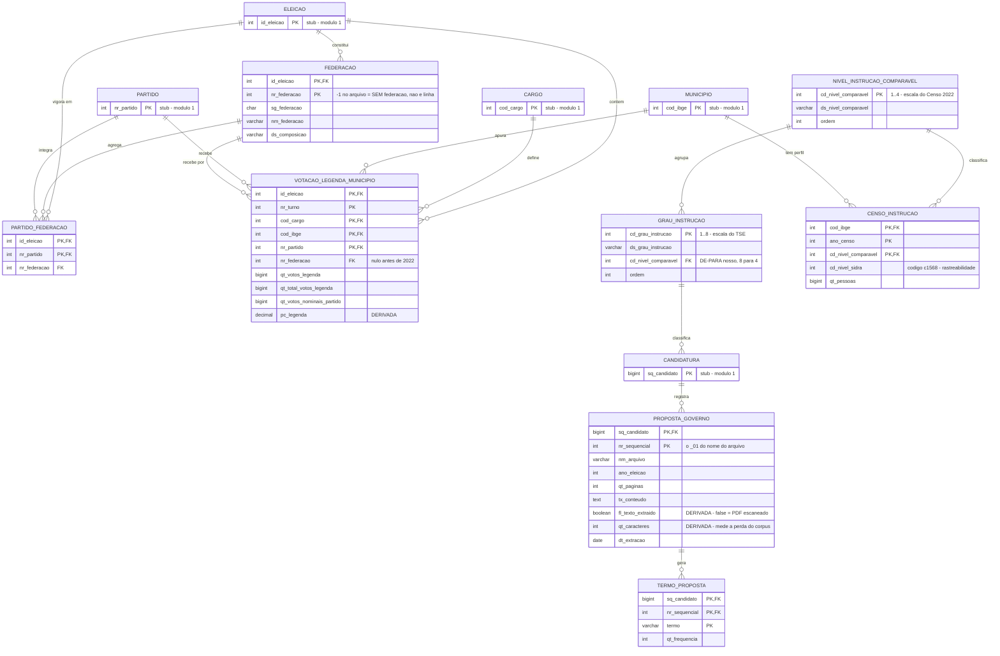

# Módulo do DER — Eduardo (Q4, Q5, Q6)

Entrega de **quinta, 24/09/2026**. Este arquivo é a minha parte dos quatro módulos
que se somam no DER da entrega: o diagrama, as chaves, os atributos derivados e um
parágrafo de justificativa por decisão, como pede o checklist da seção 6 do
[`estrategia.md`](estrategia.md).

Documentos irmãos: [`der.md`](der.md) (rascunho do grupo, **anterior às correções
da seção 4.1**), [`esquemas.md`](esquemas.md) (colunas reais dos arquivos baixados)
e [`fontes-de-dados.md`](fontes-de-dados.md).

| | |
|---|---|
| **Q4** | grau de instrução do candidato × instrução da população |
| **Q5** | votos de legenda por partido, com federação a partir de 2022 |
| **Q6** | propostas de governo em PDF → nuvem de palavras |

---

## 1. Fronteira do módulo

Declaro por inteiro **oito** entidades. Outras cinco entram como *stub* — só a PK,
porque nascem no módulo 1 (núcleo eleitoral) e redesenhá-las aqui só criaria duas
versões da mesma coisa para conciliar na consolidação.

| Declaro por inteiro | Consumo como stub (módulo 1) |
|---|---|
| `FEDERACAO` | `MUNICIPIO (cod_ibge)` |
| `PARTIDO_FEDERACAO` | `PARTIDO (nr_partido)` |
| `VOTACAO_LEGENDA_MUNICIPIO` | `ELEICAO (id_eleicao)` |
| `NIVEL_INSTRUCAO_COMPARAVEL` | `CARGO (cod_cargo)` |
| `GRAU_INSTRUCAO` | `CANDIDATURA (sq_candidato)` |
| `CENSO_INSTRUCAO` | |
| `PROPOSTA_GOVERNO` | |
| `TERMO_PROPOSTA` | |

`FEDERACAO`, `PARTIDO_FEDERACAO` e `NIVEL_INSTRUCAO_COMPARAVEL` **não existem no
rascunho do grupo** — são as três entidades novas deste módulo.

### Conformidade com o contrato de chaves

Nome e tipo conforme a seção 3 do [`estrategia.md`](estrategia.md), sem exceção:

| Chave | Tipo | Uso aqui |
|---|---|---|
| `municipio.cod_ibge` | `INTEGER` (7 dígitos) | FK em `VOTACAO_LEGENDA_MUNICIPIO`, `CENSO_INSTRUCAO` |
| `municipio.cod_tse` | `VARCHAR(5)` | só na carga, para resolver `SG_UE` → `cod_ibge` |
| `candidatura.sq_candidato` | `BIGINT` | FK em `PROPOSTA_GOVERNO` |
| `eleicao.ano` + `nr_turno` | `INTEGER` | `nr_turno` é parte da PK de `VOTACAO_LEGENDA_MUNICIPIO` |
| `partido.nr_partido` | `INTEGER` | FK em `VOTACAO_LEGENDA_MUNICIPIO`, `PARTIDO_FEDERACAO` |

---

## 2. Diagrama

---

## 3. Entidades, uma a uma

### `FEDERACAO` — nova

Fonte: `consulta_cand` (2022+) e `votacao_partido_munzona` (2022+), colunas
`NR_FEDERACAO`, `NM_FEDERACAO`, `SG_FEDERACAO`, `DS_COMPOSICAO_FEDERACAO`.

**PK composta `(id_eleicao, nr_federacao)`.** A composição de uma federação muda de
eleição para eleição, então o número sozinho não identifica a coisa — identifica
só dentro do ano. É a mesma lógica da decisão ③ da seção 4 do
[`estrategia.md`](estrategia.md), que resolveu não modelar sucessão partidária:
identidade dentro do ano, sem continuidade histórica.

🚨 **`NR_FEDERACAO = -1` é sentinela de "sem federação", não é uma federação.** Se
essa linha entrar na tabela, todo partido isolado do país passa a ser membro de uma
federação fantasma, e o `GROUP BY` da Q5 devolve número sem erro nenhum. É a mesma
família de bug do `NR_CPF_CANDIDATO = '-4'` que derrubou a primeira versão da Q12
(seção 5 do [`estrategia.md`](estrategia.md)): o campo não fica vazio, fica com um
valor, então checagem de nulo passa. A carga precisa de `WHERE nr_federacao <> -1`
explícito, com comentário dizendo por quê.

### `PARTIDO_FEDERACAO` — nova, associativa

Fonte: as mesmas colunas, uma linha por `(ano, partido)` distinto.

**PK `(id_eleicao, nr_partido)`.** Não é N:N — um partido está em **no máximo uma**
federação numa dada eleição, então dentro do ano é 1:N. A aparência de N:N só surge
quando se olha a série histórica, porque o mesmo partido pode trocar de federação
entre eleições. A PK escolhida é o que trava essa regra: com `nr_partido` na chave,
o banco recusa fisicamente um partido em duas federações no mesmo ano.

A composição vem de `NR_PARTIDO` + `NR_FEDERACAO` linha a linha, **não** do parse de
`DS_COMPOSICAO_FEDERACAO` (que é texto do tipo `"PT / PCdoB / PV"`). A string fica
como atributo informativo em `FEDERACAO`, para conferência humana.

### `VOTACAO_LEGENDA_MUNICIPIO`

Fonte: `votacao_partido_munzona` (2016–2026). Grão do arquivo: ano × turno × cargo ×
município × **zona** × partido × `ST_VOTO_EM_TRANSITO`.

**Duas agregações deliberadas na carga**, ambas somando, nenhuma perdendo dado que
alguma pergunta use:

- **Zona eleitoral sai.** Decisão do grupo, registrada no módulo 2 do
  [`der.md`](der.md): nenhuma das 12 perguntas usa zona, e ela multiplica o volume.
- **`ST_VOTO_EM_TRANSITO` sai.** Vêm duas linhas por combinação (`S` e `N`); somar
  as duas dá o total do município. Carregar sem agregar duplica a PK.

**Carrego só três dos oito campos `QT_`**, e isso resolve de graça a armadilha de
renomeação de 2018:

| Campo | 2018 | 2020+ |
|---|---|---|
| `QT_VOTOS_LEGENDA_VALIDOS` | ✅ | ✅ |
| `QT_TOTAL_VOTOS_LEG_VALIDOS` | ✅ | ✅ |
| `QT_VOTOS_NOMINAIS_VALIDOS` | ✅ | ✅ |
| votos nominais convertidos em legenda | `QT_VOTOS_NOMINAIS_CONVR_LEG` | `QT_VOTOS_NOM_CONVR_LEG_VALIDOS` |
| `QT_VOTOS_LEGENDA_ANULADOS` | ❌ não existe | ✅ |
| `QT_VOTOS_NOMINAIS_ANULADOS` | ❌ não existe | ✅ |

O campo que muda de nome **não precisa ser lido**: ele é
`qt_total_votos_legenda - qt_votos_legenda`. A linha de exemplo de 2022 no
[`esquemas.md`](esquemas.md) confirma a identidade (`12 = 12 + 0`). Os dois
`_ANULADOS` ficam fora porque só existem de 2020 em diante e nenhuma das 12
perguntas os usa — carregá-los obrigaria a declarar duas gerações de staging para
dado que ninguém consulta.

`nr_federacao` é **FK opcional**, nula em 2016–2020 porque federação não existia.
Com ela na tabela, a Q5 agrega por sigla ou por federação sem join adicional.

### `NIVEL_INSTRUCAO_COMPARAVEL` — nova

Quatro linhas, a escala do Censo 2022 (classificação `c1568` da tabela SIDRA 10061).
É a **dimensão compartilhada** que torna a Q4 possível: sem ela, as duas escalas de
instrução não se encontram em lugar nenhum do modelo.

| `cd_nivel_comparavel` | `ds_nivel_comparavel` |
|---|---|
| 1 | Sem instrução e fundamental incompleto |
| 2 | Fundamental completo e médio incompleto |
| 3 | Médio completo e superior incompleto |
| 4 | Superior completo |

### `GRAU_INSTRUCAO`

Fonte: `consulta_cand`, colunas `CD_GRAU_INSTRUCAO` / `DS_GRAU_INSTRUCAO`. Oito
linhas, a escala do TSE, mais o `cd_nivel_comparavel` que é **o de-para escrito por
nós** (seção 4 abaixo).

### `CENSO_INSTRUCAO`

Fonte: `dados/raw/ibge/sidra/10061_instrucao_municipios.json` — 27.850 linhas,
5.570 municípios.

⚠️ **Não carregar a linha `Total`.** 27.850 ÷ 5.570 = exatamente **5 registros por
município**, ou seja `Total` + os 4 níveis. O `Total` é `SUM` dos outros quatro;
carregá-lo dobra toda contagem da Q4 sem gerar erro.

`cd_nivel_sidra` guarda o código bruto da classificação (`120704` etc.) só para
rastreabilidade — dá para voltar do nosso modelo ao arquivo de origem.

O universo da 10061 é **"pessoas de 18 anos ou mais de idade"**, que é exatamente o
universo dos candidatos (elegibilidade mínima é 18 anos). A Q4 compara bases
equivalentes. Isso não seria verdade contra população total, que inclui menores —
e é o tipo de detalhe que muda o resultado sem aparecer no gráfico.

### `PROPOSTA_GOVERNO`

Fonte: `proposta_governo_{ano}_PI.zip`. Só 2024 tem **504 PDFs / 328 MB**
(seção 1.4 do [`fontes-de-dados.md`](fontes-de-dados.md)).

**PK composta `(sq_candidato, nr_sequencial)`.** O nome do arquivo é
`{ano}{UF}{SQ_CANDIDATO}_{seq}.pdf` — por exemplo `2024PI180001881915_01.pdf`. Esse
`_01` existe justamente porque **um candidato pode registrar mais de um PDF**. O
rascunho do grupo tem `sq_candidato` como PK sozinha e a cardinalidade
`CANDIDATURA ||--o| PROPOSTA_GOVERNO`; as duas coisas quebram no primeiro candidato
com `_02`. Aqui a cardinalidade é `||--o{`.

A chave de join sai de um **parse do nome do arquivo**, não de casamento por nome de
candidato. `nm_arquivo` fica guardado como proveniência.

`tx_conteudo` guarda o texto integral extraído — ver a decisão na seção 5.

### `TERMO_PROPOSTA`

**Entidade inteiramente derivada** de `PROPOSTA_GOVERNO.tx_conteudo`: tokenização,
remoção de stopwords em português e contagem. Não é dado de origem; é resultado
materializado, e está marcada como tal por exigência do checklist.

---

## 4. O de-para de instrução — a contribuição da Q4

As duas escalas **não são compatíveis**: o TSE tem 8 graus, o Censo 2022 tem 4
níveis. A Q4 não existe sem um agrupamento escrito por nós. É o mesmo tipo de
tabela de-para que a classificação público/privado da Q10 exige, e que a seção 3 do
[`estrategia.md`](estrategia.md) já reconhece como contribuição do trabalho.

| `cd_grau_instrucao` (TSE) | `ds_grau_instrucao` | → | `cd_nivel_comparavel` |
|---|---|---|---|
| 1 | Analfabeto | → | 1 |
| 2 | Lê e escreve | → | **1** ⚠️ |
| 3 | Ensino Fundamental Incompleto | → | 1 |
| 4 | Ensino Fundamental Completo | → | 2 |
| 5 | Ensino Médio Incompleto | → | 2 |
| 6 | Ensino Médio Completo | → | 3 |
| 7 | Superior Incompleto | → | 3 |
| 8 | Superior Completo | → | 4 |

**Sete das oito linhas são identidade.** A única escolha nossa é a linha 2: "Lê e
escreve" no TSE significa exatamente *nenhuma etapa escolar concluída*, e a
categoria "sem instrução" do Censo inclui quem lê e escreve mas nunca completou
etapa alguma. Por isso vai para o nível 1. O critério fica escrito aqui e no
relatório; quem discordar pode trocar uma linha da tabela e recontar, o que é
precisamente a razão de isso ser uma entidade e não um `CASE` escondido no SQL.

⚠️ **A conferir com os dados na mão:** `SELECT DISTINCT CD_GRAU_INSTRUCAO,
DS_GRAU_INSTRUCAO FROM consulta_cand ORDER BY 1`. O [`esquemas.md`](esquemas.md) só
mostra uma linha de exemplo, que confirma `6 = ENSINO MÉDIO COMPLETO` — consistente
com a numeração acima, mas é um ponto de oito. Se algum código divergir, muda a
tabela, não o modelo.

---

## 5. Decisões, com justificativa

Um parágrafo por decisão, como o checklist da seção 6 do
[`estrategia.md`](estrategia.md) exige.

**① O de-para de instrução é entidade, não coluna nem `CASE`.**
`NIVEL_INSTRUCAO_COMPARAVEL` existe como dimensão compartilhada, e tanto
`GRAU_INSTRUCAO` quanto `CENSO_INSTRUCAO` apontam para ela. A alternativa era um
`CASE` no `mart_q04`. Rejeitada porque a Q4 depende de uma escolha nossa de
agrupamento e essa escolha precisa estar visível no diagrama para a pergunta ter
"caminho de joins traçável", que é item do checklist. Além disso, uma tabela de 8
linhas é revisável por quem não lê SQL.

**② `tx_conteudo` guarda o texto integral dos PDFs no core.** O custo é o texto cru
dentro do `.duckdb`. Aceito por dois motivos: o `.duckdb` está no `.gitignore` e é
reconstruído por script, não passado entre nós por commit, então o tamanho do
arquivo pesa pouco; e extrair texto de 504 PDFs é lento, enquanto a lista de
stopwords vai ser ajustada várias vezes até a nuvem ficar apresentável. Com o texto
no banco, recontar é uma query; sem ele, é reprocessar o corpus inteiro.

**③ `PROPOSTA_GOVERNO` existe como entidade separada de `TERMO_PROPOSTA`.** Só
assim há onde morar o `fl_texto_extraido`. Sem esse atributo não é possível dizer
quantos PDFs eram imagem escaneada, e a seção 5 do [`estrategia.md`](estrategia.md)
manda medir e declarar exatamente isso. Num modelo com apenas `TERMO_PROPOSTA`, o
candidato cuja proposta não pôde ser lida simplesmente não aparece — a perda do
corpus fica invisível em vez de declarada.

**④ Não declaro `PARTIDO` por inteiro.** `PARTIDO` aparece no módulo 1, no módulo 2
e nas Q8/Q9 da Duda, que é quem precisa do `cd_espectro` da decisão ③. Declará-lo
aqui produziria duas versões da mesma entidade para conciliar na quinta. Declaro
`FEDERACAO`, que é a única entidade nova de fato deste módulo e que ninguém mais
pediu.

**⑤ Zona eleitoral e voto em trânsito são somados na carga.** Agregação deliberada,
não perda: nenhuma das 12 perguntas usa zona, e as duas linhas de
`ST_VOTO_EM_TRANSITO` (`S` e `N`) somadas dão o total do município. Carregar sem
agregar duplicaria a PK de `VOTACAO_LEGENDA_MUNICIPIO`.

**⑥ Os campos `_ANULADOS` ficam fora de `VOTACAO_LEGENDA_MUNICIPIO`.** Existem só
de 2020 em diante e nenhuma pergunta os usa. Incluí-los obrigaria a manter duas
gerações de staging para dado que ninguém consulta.

---

## 6. Atributos derivados

O checklist exige que todo atributo derivado esteja marcado. Os deste módulo:

| Atributo | Derivação |
|---|---|
| `VOTACAO_LEGENDA_MUNICIPIO.pc_legenda` | `qt_votos_legenda ÷ (qt_votos_legenda + qt_votos_nominais_partido)` |
| `PROPOSTA_GOVERNO.fl_texto_extraido` | `qt_caracteres > 0` — falso indica PDF escaneado |
| `PROPOSTA_GOVERNO.qt_caracteres` | `length(tx_conteudo)` |
| `GRAU_INSTRUCAO.cd_nivel_comparavel` | de-para nosso (seção 4) — derivado de decisão, não de cálculo |
| `TERMO_PROPOSTA` (**entidade inteira**) | tokenização + stopwords + contagem sobre `tx_conteudo` |

Fora da tabela, mas no mesmo espírito: `VOTACAO_LEGENDA_MUNICIPIO` inteira é uma
agregação de `votacao_partido_munzona` (zona e voto em trânsito somados fora), e o
campo "votos nominais convertidos em legenda" é obtido como
`qt_total_votos_legenda - qt_votos_legenda` em vez de carregado.

---

## 7. Caminho de joins, por pergunta

Prova de que as três perguntas fecham no diagrama, como o checklist pede.

| | Caminho |
|---|---|
| **Q4** | `CENSO_INSTRUCAO` → `NIVEL_INSTRUCAO_COMPARAVEL` ← `GRAU_INSTRUCAO` ← `CANDIDATURA`; os dois lados fecham em `MUNICIPIO` |
| **Q5** | `VOTACAO_LEGENDA_MUNICIPIO` → `PARTIDO` / `FEDERACAO` / `MUNICIPIO` / `CARGO` / `ELEICAO` |
| **Q6** | `TERMO_PROPOSTA` → `PROPOSTA_GOVERNO` → `CANDIDATURA` → `PARTIDO` / `MUNICIPIO` |

---

## 8. Limites declarados e o que falta medir

### A Q4 no grão de município só vale em eleição municipal

`CANDIDATURA` **não tem coluna de município** — correção 3 da seção 4.1 do
[`estrategia.md`](estrategia.md). O vínculo é `SG_UE`, que é o código TSE do
município **apenas** em eleição municipal; em eleição geral `SG_UE` é a sigla da UF.

Consequência: comparar a instrução do candidato com a da população **do município**
faz sentido em **2016, 2020 e 2024**. Para 2018, 2022 e 2026 o grão possível é a UF.
Isso é limite da pergunta, não defeito do modelo, e é melhor declarar agora do que
descobrir na carga.

### Falta medir: voto de legenda de partido federado pode estar duplicado

Não sei se, de 2022 em diante, o TSE repete os votos de legenda da federação em cada
linha de partido membro ou os atribui uma única vez. **Não vou afirmar sem medir.**
Se houver duplicação e a Q5 agregar por federação, o total sai multiplicado pelo
número de membros.

Validação (precisa dos dados baixados): somar `qt_votos_legenda` por federação e
comparar com o total de votos de legenda do `detalhe_votacao_munzona` no mesmo
município, cargo e turno. Se bater, não há duplicação; se der múltiplo inteiro do
número de partidos da federação, há — e a carga precisa deduplicar.

### Falta medir: taxa de PDFs escaneados na Q6

A seção 5 do [`estrategia.md`](estrategia.md) manda rodar a extração em ~20 PDFs do
PI e ver a taxa de retorno vazio, antes de prometer qualquer coisa sobre a Q6. Se
for alta, a saída é restringir o corpus aos que têm texto e declarar a perda — não
partir para OCR. `fl_texto_extraido` e `qt_caracteres` existem para tornar essa
declaração um `SELECT` em vez de uma estimativa.

---

## 9. Checklist da quinta, aplicado a este módulo

- [x] Toda entidade tem PK declarada, e toda PK composta está explícita — seis das
      oito são compostas.
- [x] Toda FK aponta para PK que existe em outro módulo, com o mesmo nome e tipo do
      contrato de chaves (seção 1).
- [x] Cada uma das minhas três perguntas tem caminho de joins traçável (seção 7).
- [x] Todo atributo derivado está marcado (seção 6).
- [x] Sem entidade órfã: as cinco emprestadas entram como stub com a PK, então o
      módulo se cola no módulo 1 sem redefinir nada.
- [x] Um parágrafo escrito por decisão (seção 5).
