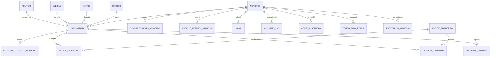
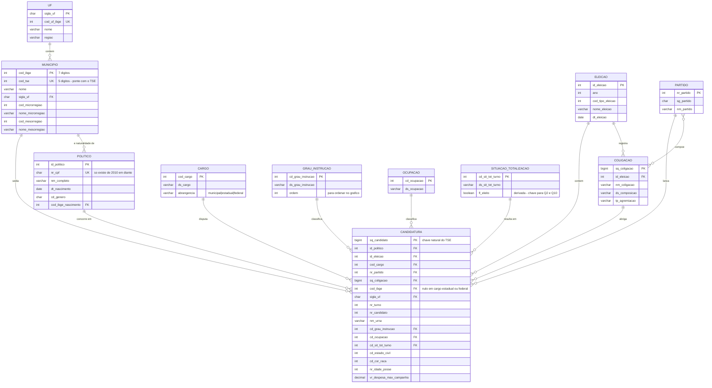
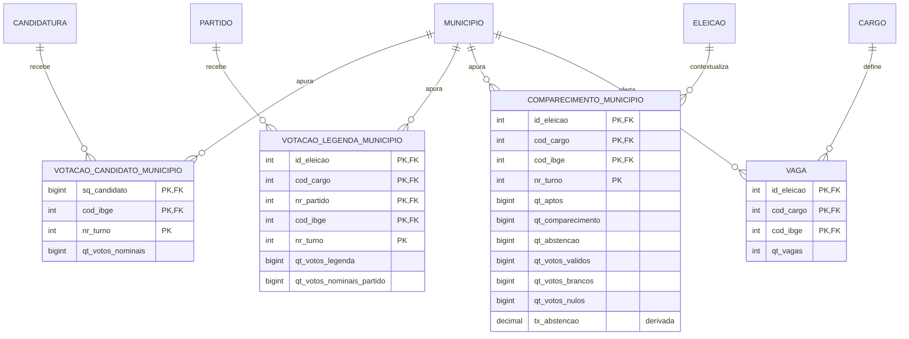
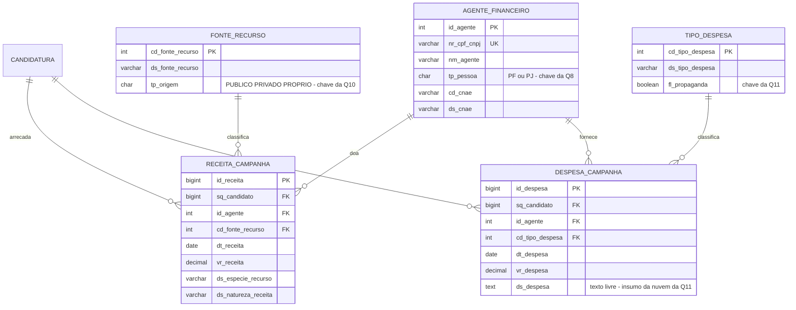
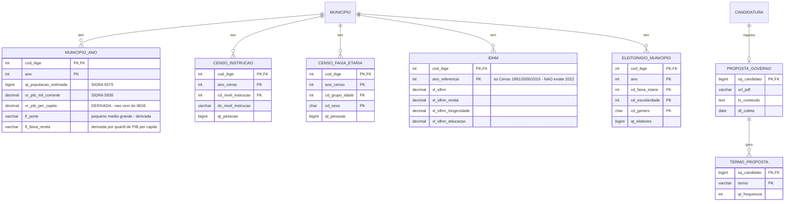

# DER proposto — entrega de quinta (24/09/2026)

Modelo lógico em notação pé-de-galinha (Mermaid `erDiagram`). Cada módulo é a
tarefa de um integrante; a soma dos quatro é o DER da entrega.

> **Status:** o grupo vai desenhar o diagrama à mão. Este arquivo é **rascunho e
> fonte de consulta** (lista de entidades, atributos, cardinalidades), não a entrega.
>
> ⚠️ **Antes de desenhar, leia a seção 4.1 do [`estrategia.md`](estrategia.md).**
> Sete correções saíram da conferência dos arquivos reais e ainda **não** estão
> aplicadas aqui — entre elas: `cod_tse` é texto e não inteiro, falta a entidade
> `FEDERACAO`, e três atributos de `CANDIDATURA` não existem nos anos da nossa base.

---

## Visão geral — como os 4 módulos se conectam

`MUNICIPIO` e `CANDIDATURA` são os dois eixos do modelo inteiro. **Todo cruzamento
TSE × IBGE passa por `MUNICIPIO`**, que é a entidade que faltava no desenho antigo.

---

## Módulo 1 — Núcleo eleitoral

> Fonte: `consulta_cand`, `consulta_coligacao`, `municipio_tse_ibge`,
> `localidades/municipios` (IBGE). Responde Q4, Q7, Q12 e sustenta todo o resto.

**Decisões que precisam ficar escritas no relatório:**

- `POLITICO` ≠ `CANDIDATURA`. A pessoa é uma; as candidaturas são várias ao longo
  dos anos. **Sem essa separação a Q12 não existe.**
- Atributos que **mudam entre eleições** (grau de instrução, ocupação, estado civil,
  partido) ficam em `CANDIDATURA`, não em `POLITICO`. Só nascimento, CPF, nome e
  sexo ficam na pessoa.
- Deduplicar `POLITICO`: CPF onde existir; nos anos antigos, `nome + data_nascimento
  + UF`. ⚠️ **Verificar localmente a partir de que ano o `consulta_cand` traz CPF** —
  isso define até onde a Q12 consegue voltar com segurança.
- Partidos mudam de nome e número (PFL → DEM → União Brasil). Para a Q9 (viés na
  linha do tempo) isso é um problema real: ou se adota a sigla vigente no ano, ou se
  cria uma tabela `PARTIDO_SUCESSAO`. **Decidir e documentar.**

---

## Módulo 2 — Resultados e votos

> Fonte: `votacao_candidato_munzona`, `votacao_partido_munzona`,
> `detalhe_votacao_munzona`, `consulta_vagas`. Responde Q1, Q2, Q3, Q5, Q9, Q10.

**Cuidado de granularidade:** o TSE entrega tudo por **município × zona eleitoral**.
Zona não interessa a nenhuma das 12 perguntas e multiplica o volume. **Somar zona
fora já na carga** (`GROUP BY município`). Registrar a decisão — é uma agregação
deliberada, não perda de dado.

---

## Módulo 3 — Finanças de campanha

> Fonte: `prestacao_de_contas_eleitorais_candidatos_{ano}` (2018+) e
> `prestacao_contas_final_{ano}` (≤2016). Responde Q1, Q2, Q8, Q10, Q11.

**`tp_origem` em `FONTE_RECURSO` é a entidade inteira da Q10.** Fundo Partidário e
FEFC = público; doação de PF/PJ e recursos próprios = privado. Essa classificação
é **nossa**, não vem pronta do TSE — precisa de uma tabela de-para escrita à mão a
partir dos valores distintos de `DS_FONTE_RECURSO`. Vale como contribuição do
trabalho; documentar o critério.

---

## Módulo 4 — Contexto socioeconômico e texto

> Fonte: SIDRA 6579/5938/10061/9514, `localidades/municipios`,
> `perfil_eleitorado` (TSE), Atlas Brasil. Responde Q3, Q4, Q6, Q7.

**Duas observações que valem nota:**

1. `vr_pib_per_capita` é **derivada** (`vr_pib_mil_corrente × 1000 ÷
   qt_populacao_estimada`). O IBGE não publica essa variável em nenhuma das tabelas
   de PIB municipal — conferimos as duas (21 e 5938).
2. `ELEITORADO_MUNICIPIO` (TSE) é **melhor que o Censo** para a Q7: idade do
   *eleitorado*, ano a ano, é mais próxima da pergunta do que idade da *população*
   só em ano de Censo. Sugiro Censo como reserva, eleitorado como principal.

---

## Mapa pergunta → entidades

| # | Pergunta | Entidades | Módulo |
|---|---|---|---|
| 1 | $ por cadeira | `DESPESA_CAMPANHA` + `VAGA` + `CANDIDATURA` | 3 + 2 |
| 2 | Taxa de sucesso × $$ | `DESPESA_CAMPANHA` + `SITUACAO_TOTALIZACAO` | 3 + 1 |
| 3 | IBGE × partidos × votados × abstenção | `MUNICIPIO_ANO` + `COMPARECIMENTO_MUNICIPIO` + `VOTACAO_CANDIDATO_MUNICIPIO` + `PARTIDO` | 4 + 2 |
| 4 | Instrução do candidato × população | `CANDIDATURA.cd_grau_instrucao` + `CENSO_INSTRUCAO` | 1 + 4 |
| 5 | Votos de legenda × partido | `VOTACAO_LEGENDA_MUNICIPIO` | 2 |
| 6 | Proposta → nuvem de palavras | `PROPOSTA_GOVERNO` + `TERMO_PROPOSTA` | 4 |
| 7 | Jovens × não jovens × viés | `POLITICO.dt_nascimento` + `ELEITORADO_MUNICIPIO` + `VOTACAO_CANDIDATO_MUNICIPIO` | 1 + 4 + 2 |
| 8 | PJ × viés (doação) | `RECEITA_CAMPANHA` + `AGENTE_FINANCEIRO` (tp_pessoa = PJ) + `PARTIDO` | 3 |
| 9 | Viés do município na linha do tempo | `VOTACAO_CANDIDATO_MUNICIPIO` + `PARTIDO` + `ELEICAO.ano` + `MUNICIPIO.nome_mesorregiao` | 2 + 1 |
| 10 | Eleito × recurso público/privado | `RECEITA_CAMPANHA` + `FONTE_RECURSO.tp_origem` + `SITUACAO_TOTALIZACAO` | 3 + 1 |
| 11 | Onde investe em propaganda | `DESPESA_CAMPANHA.ds_despesa` + `TIPO_DESPESA` + `AGENTE_FINANCEIRO.cd_cnae` | 3 |
| 12 | Linha do tempo do político | `POLITICO` + `CANDIDATURA` (todas as eleições) | 1 |

Nenhuma das 12 ficou sem cobertura. O módulo 1 aparece em 7 delas — por isso ele é
pré-requisito dos outros três.
