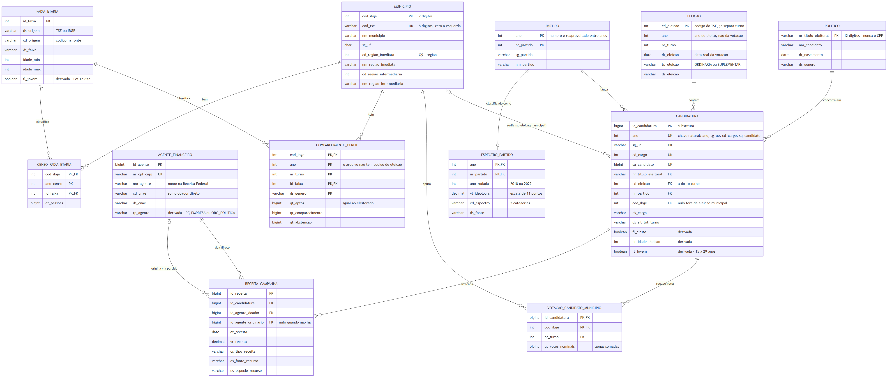

# DER da Duda — Q7, Q8 e Q9 em um só diagrama

> **Este DER foi incorporado ao [`der-geral.md`](der-geral.md)**, que une os quatro
> módulos. Duas coisas mudaram lá depois da revisão de 23/09: a receita da Q8 passou
> a incluir a de **órgãos partidários** (em 2014, R$ 1,34 bi de empresas entraram em
> partidos e R$ 406 mi em comitês), e o município nos arquivos de votação passou a
> ser resolvido com `LPAD(CD_MUNICIPIO, 5, '0')`.

Todo atributo tem fonte (arquivo e coluna). Todo número abaixo foi **medido nos
arquivos baixados em 23/09/2026**, não tirado de documentação. O que não foi
verificado está marcado com ⚠️.

| # | Pergunta | O que o diagrama precisa responder |
|---|---|---|
| **Q7** | Jovens × não jovens × viés político (2018–2024) | Candidatos jovens são de que espectro? Municípios com eleitorado mais jovem votam em que espectro? Jovem se abstém mais? |
| **Q8** | PJ × viés político (doação) | Quanto dinheiro de empresa foi para cada espectro em 2014 — e o que sobrou em 2016, depois que o STF proibiu |
| **Q9** | Viés político do município/região na linha do tempo (2016–2024) | Participação de cada espectro nos votos válidos, por município e região, eleição a eleição |

---

## O diagrama

A imagem acima (e a versão vetorial [`der-duda.svg`](../dossie/diagramas/der-duda.svg), para imprimir sem perder
resolução) é gerada do código Mermaid no arquivo indicado, que é a fonte. Se mudar o modelo,
mude o código — o GitHub renderiza o bloco sozinho.

[Diagrama](diagramas/der-duda-q7-q9.md)

São **12 entidades**: 6 compartilhadas com o resto do grupo (`MUNICIPIO`, `ELEICAO`,
`PARTIDO`, `POLITICO`, `CANDIDATURA`, `AGENTE_FINANCEIRO`) e 6 que são desta
parte (`ESPECTRO_PARTIDO`, `VOTACAO_CANDIDATO_MUNICIPIO`, `RECEITA_CAMPANHA`,
`FAIXA_ETARIA`, `COMPARECIMENTO_PERFIL`, `CENSO_FAIXA_ETARIA`).

---

## Como cada pergunta atravessa o diagrama

**Q7 — três caminhos, um por sub-pergunta:**

1. *Candidato jovem é de que espectro?* `CANDIDATURA.fl_jovem` → `PARTIDO` →
   `ESPECTRO_PARTIDO`.
2. *Município mais jovem vota em que espectro?* `COMPARECIMENTO_PERFIL` agregado por
   município (parcela de aptos com `fl_jovem`) ↔ `VOTACAO_CANDIDATO_MUNICIPIO` →
   `CANDIDATURA` → `PARTIDO` → `ESPECTRO_PARTIDO`.
3. *Jovem se abstém mais?* `COMPARECIMENTO_PERFIL.qt_abstencao / qt_aptos` por
   `FAIXA_ETARIA`.

O enunciado original pede "população do município × idade do candidato": é o
`CENSO_FAIXA_ETARIA`, que entra como segundo retrato etário (população, Censo 2022)
ao lado do eleitorado (aptos, a cada eleição).

**Q8 — o dinheiro precisa ser seguido por dois caminhos:**

`RECEITA_CAMPANHA` → `AGENTE_FINANCEIRO` como **doador direto** *e* como **doador
originário** → `CANDIDATURA` → `PARTIDO` → `ESPECTRO_PARTIDO`. As duas ligações entre
`RECEITA_CAMPANHA` e `AGENTE_FINANCEIRO` não são redundância — ver achado 4.

**Q9 — série histórica por território:**

`VOTACAO_CANDIDATO_MUNICIPIO` → `CANDIDATURA` → `PARTIDO` → `ESPECTRO_PARTIDO`, agrupado
por `MUNICIPIO` (ou `cd_regiao_imediata`) e por `ELEICAO.ano`, só com
`tp_eleicao = 'ORDINARIA'`. O mapa usa a malha GeoJSON do IBGE, cujo `codarea` é o
`cod_ibge`.

---

## O que os dados mostraram — e por que o diagrama é assim

Cada decisão do diagrama responde a algo medido.

| # | Achado | Consequência no diagrama |
|---|---|---|
| 1 | Em 2024 o CPF vem `-4` (dado protegido, LGPD) nas 463.859 linhas | `POLITICO` chaveado por título de eleitor |
| 2 | O número do partido é reaproveitado: **25** foi DEM e virou PRD; **44** foi PRP e virou UNIÃO | `PARTIDO` chaveado por **(ano, nr_partido)** |
| 3 | Todo arquivo anual traz eleições suplementares misturadas (8 a 1.186 linhas/ano) — a UNIÃO "de 2020" são suplementares de 2022, 2023 e 2024 | `ELEICAO` separa `ano` (pleito) de `dt_eleicao` (votação real) e tem `tp_eleicao` |
| 4 | Em 2014, **50,3% da receita (R$ 2,21 bi) veio de CNPJ de partido/comitê**, não de empresa | `AGENTE_FINANCEIRO.tp_agente` por CNAE, não por nº de dígitos |
| 5 | Em 2014, **R$ 1,77 bi** passaram por partido tendo **empresa como doador originário** — mais que a doação direta de empresa (R$ 1,31 bi) | `RECEITA_CAMPANHA` com **duas** FKs para `AGENTE_FINANCEIRO` |
| 6 | Doação direta de empresa caiu de **R$ 1,31 bi (29,8%) em 2014 para R$ 6,2 mi (0,21%) em 2016** | Confirma a premissa da Q8 com dado: 2016 é o marco zero |
| 7 | `perfil_eleitorado.QT_ELEITORES` = `perfil_comparecimento_abstencao.QT_APTOS` (2.698.764 nos dois, PI 2024) | Uma entidade só (`COMPARECIMENTO_PERFIL`) em vez de duas com a mesma contagem |
| 8 | As faixas etárias do TSE e do IBGE têm corte exatamente em 29/30 | "Jovem" é uma regra única em `FAIXA_ETARIA`, sem faixa atravessando o corte |
| 9 | `NR_IDADE_DATA_POSSE` não existe de 2018 em diante | Idade é **derivada** de `dt_nascimento` e `dt_eleicao` |
| 10 | `SQ_CANDIDATO` só é único a partir de 2010 (antes é contador por unidade eleitoral) | `CANDIDATURA` com chave substituta, como o Enrico implementou |
| 11 | O `CD_ELEICAO` **muda entre os turnos para o mesmo candidato** — 619 → 620 em 2024 (204 casos), 546 → 547 em 2022 (52 casos) | `CANDIDATURA.cd_eleicao` é o do 1º turno; o turno fica no fato de votação |
| 12 | `perfil_comparecimento_abstencao` **não tem código de eleição nem cargo** — só ano e turno. No mesmo dia pode haver eleição federal e estadual (544 e 546 em 2022) com os mesmos eleitores | `COMPARECIMENTO_PERFIL` chaveado por (ano, turno), sem FK para `ELEICAO` |

Um achado de leitura, não de modelagem, mas que afeta diretamente a Q8:

| 13 | O `receitas_candidatos_2014_brasil.txt` tem **4 linhas** com aspas sem escape dentro do nome do doador (`"...ROLLEMBERG "40" GOVERNADOR"`). Cada uma "abre" um campo que engole as seguintes: com `ignore_errors=true` somem **11.734 linhas e R$ 206 milhões**, em silêncio | Dobrar as aspas internas antes de ler. Com isso a leitura estrita traz 427.489 de 427.489 linhas |

---

## As decisões, com fonte

**Jovem = 15 a 29 anos.** Lei nº 12.852/2013 (Estatuto da Juventude), art. 1º, §1º.
Nas faixas do TSE isso é `1600` a `2529` (16 a 29 anos — ninguém vota com 15); nas do
IBGE, "15 a 19", "20 a 24" e "25 a 29".

**Espectro partidário.** Duas rodadas de survey com cientistas políticos, escala de
11 pontos:

- Bolognesi, Ribeiro e Codato (2023), *Uma nova classificação ideológica dos
  partidos políticos brasileiros*, **Dados**, v. 66, n. 2 — rodada de **2018**;
- Bolognesi, Ribeiro, Codato e Silva (2025), *O desaparecimento do centro
  ideológico no sistema partidário brasileiro*, **Opinião Pública**, v. 31 —
  rodadas de **2018 e 2022**.

Regra: eleições de 2014 a 2020 usam a rodada de 2018; 2022 e 2024 usam a de 2022.

- ⚠️ Partidos criados depois de 2022 (PRD, 2023) não estão em nenhuma rodada. O grupo
  precisa decidir: deixar sem classificação ou herdar dos partidos de origem — e
  escrever a regra.
- ⚠️ O corte do `vl_ideologia` nas 5 categorias de `cd_espectro` ainda precisa ser
  definido. Se os artigos publicarem as faixas, usar as deles.

**Empresa ≠ CNPJ.** CNPJ cujo CNAE é **9492-8/00 — Atividades de organizações
políticas** (Classificação Nacional de Atividades Econômicas, IBGE) é partido,
comitê ou campanha, não empresa. Em 2014 o doador direto traz o código
(`Cod setor econômico do doador`); o doador originário só traz a descrição
(`Setor econômico do doador originário`), então ali a regra usa o texto.

**Dinheiro de empresa na Q8** = doação direta de `EMPRESA` + receita cujo doador
originário é `EMPRESA`. Contar só um dos dois lados erra por mais de R$ 1 bi.

---

## Dicionário — de onde vem cada atributo

Arquivos do TSE em `dados/raw/`, IBGE via SIDRA e FTP. Colunas entre aspas são do
leiaute antigo (2014–2016), que usa nomes em português.

### Compartilhadas

| Entidade.atributo | Fonte |
|---|---|
| `MUNICIPIO.cod_ibge` / `cod_tse` / `nm_municipio` / `sg_uf` | `municipio_tse_ibge.csv` → `CD_MUNICIPIO_IBGE`, `CD_MUNICIPIO_TSE`, `NM_MUNICIPIO_IBGE`, `SG_UF` |
| `MUNICIPIO.cd/nm_regiao_imediata`, `cd/nm_regiao_intermediaria` | FTP do PIB dos Municípios (`base_de_dados_2010_2023_xlsx.zip`) → "Código/Nome da Região Geográfica Imediata/Intermediária" |
| `ELEICAO.*` | `consulta_cand` / `votacao_candidato_munzona` → `CD_ELEICAO`, `ANO_ELEICAO`, `NR_TURNO`, `DT_ELEICAO`, `NM_TIPO_ELEICAO`, `DS_ELEICAO` |
| `PARTIDO.*` | `consulta_cand` → `ANO_ELEICAO`, `NR_PARTIDO`, `SG_PARTIDO`, `NM_PARTIDO` |
| `POLITICO.*` | `consulta_cand` → `NR_TITULO_ELEITORAL_CANDIDATO` (com zero à esquerda até 12 dígitos), `NM_CANDIDATO`, `DT_NASCIMENTO`, `DS_GENERO` |
| `CANDIDATURA.*` | `consulta_cand` → `SQ_CANDIDATO`, `SG_UE`, `CD_CARGO`, `DS_CARGO`, `DS_SIT_TOT_TURNO`; `cod_ibge` via `SG_UE` → `MUNICIPIO.cod_tse` |
| `CANDIDATURA.fl_eleito` | derivada de `DS_SIT_TOT_TURNO` ∈ {ELEITO, ELEITO POR QP, ELEITO POR MEDIA, MEDIA} — mesma regra do Enrico |
| `CANDIDATURA.nr_idade_eleicao` | derivada: `ELEICAO.dt_eleicao` do 1º turno − `POLITICO.dt_nascimento` |
| `AGENTE_FINANCEIRO.*` (2014–2016) | receitas → "CPF/CNPJ do doador", "Nome do doador (Receita Federal)", "Cod setor econômico do doador", "Setor econômico do doador"; e as colunas "... do doador originário" |

### Desta parte

| Entidade.atributo | Fonte |
|---|---|
| `ESPECTRO_PARTIDO.*` | artigos de Bolognesi et al. (seção anterior) — **única fonte que não é governamental**, e por isso fica numa entidade separada de `PARTIDO` |
| `VOTACAO_CANDIDATO_MUNICIPIO.*` | `votacao_candidato_munzona_{ano}_BRASIL.csv` → `SQ_CANDIDATO`, `LPAD(CD_MUNICIPIO, 5, '0')` (o arquivo traz o código TSE **sem** o zero — sem o LPAD somem 519 municípios), `NR_TURNO`, `QT_VOTOS_NOMINAIS` somado sobre `NR_ZONA`; linhas com `SG_UF = 'ZZ'` (exterior) ficam fora |
| `RECEITA_CAMPANHA.*` (2014) | `receitas_candidatos_2014_brasil.txt` → "Sequencial Candidato", "Data da receita", "Valor receita", "Tipo receita", "Fonte recurso", "Especie recurso" |
| `RECEITA_CAMPANHA.*` (2016) | `receitas_candidatos_prestacao_contas_final_2016_brasil.txt` — mesmas colunas, incluindo as do doador originário |
| `FAIXA_ETARIA` (TSE) | `perfil_comparecimento_abstencao` → `CD_FAIXA_ETARIA`, `DS_FAIXA_ETARIA` (16, 17, 18, 19, 20, 21–24, 25–29, 30–34 … 100+; `-3` = inválido) |
| `FAIXA_ETARIA` (IBGE) | SIDRA 9606, classificação 287 → faixas quinquenais 0–4 … 95–99, 100+ |
| `COMPARECIMENTO_PERFIL.*` | `perfil_comparecimento_abstencao_{ano}` → `CD_MUNICIPIO`, `ANO_ELEICAO`, `NR_TURNO` (não há `CD_ELEICAO`), `CD_FAIXA_ETARIA`, `DS_GENERO`, `QT_APTOS`, `QT_COMPARECIMENTO`, `QT_ABSTENCAO`, somados sobre zona e os demais recortes |
| `CENSO_FAIXA_ETARIA.*` | SIDRA 9606 → `D1C` (município), `D3N` (ano), `D6N` (faixa), `V` (valor) |

**Por que não há `ELEITORADO_PERFIL`:** o `QT_APTOS` do comparecimento é idêntico ao
`QT_ELEITORES` do perfil do eleitorado (achado 7). Modelar os dois seria guardar a
mesma contagem em dois lugares.

**Por que não há `FEDERACAO`:** nenhuma das três perguntas depende dela — o espectro
é por partido. Está no DER do Dudu, onde a Q5 precisa.

---

## Dependências e problemas encontrados nos outros ramos

Levantados ao conferir os commits de 21 a 23/09. **Nenhum foi corrigido aqui** —
são dos donos de cada parte.

1. **O staging do Enrico não acha nenhum arquivo no `main` atual.** Ele foi escrito
   em 21/09 sobre a extração só do PI (glob `receitas_candidatos_????_??.txt`). Em
   23/09 o Davi mudou a prestação de contas para extrair o nacional, que grava
   `_brasil.txt` / `_BRASIL.csv` — 6 letras, fora do `??`. Simulado contra os zips:
   com extração PI o glob acha o arquivo; com a nacional, **não acha nada**, nos dois
   leiautes. Bloqueia a Q8 e a Q1/Q2.

2. **O contrato do `stg_receita` não tem doador originário.** O erro é do contrato,
   que eu escrevi, não do Enrico — ele o seguiu à risca. Sem as colunas do originário
   a Q8 perde R$ 1,77 bi de 2014 (achado 5). Faltam `cpf_cnpj_doador_originario` e
   `ds_cnae_doador_originario`. Atenção: de 2018 em diante o originário **não** é
   coluna — vem no arquivo separado `receitas_candidatos_doador_originario`.

3. **`tp_pessoa` por número de dígitos classifica partido como pessoa jurídica.**
   Serve para separar CPF de CNPJ, mas não para identificar empresa (achado 4). A Q8
   precisa do `tp_agente` por CNAE.

4. **Aspas sem escape em 2014** (achado 13). Como o staging do Enrico é estrito (sem
   `ignore_errors`), ele vai *falhar* em vez de perder dado — o que é melhor, mas
   ainda precisa da correção antes de ler o arquivo nacional.

5. **Chaves divergentes entre os DERs.** O Dudu usa `CANDIDATURA.sq_candidato` e
   `PARTIDO.nr_partido` como PK; o Enrico implementou `id_candidatura` substituta. As
   duas PKs do Dudu quebram no tempo (achados 2 e 10). Vale unificar antes da carga.
