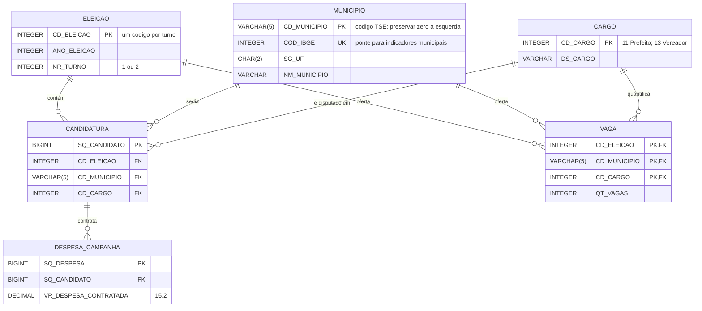

```mermaid
erDiagram
    ELEICAO   ||--o{ CANDIDATURA     : "contem"
    MUNICIPIO ||--o{ CANDIDATURA     : "sedia"
    CARGO     ||--o{ CANDIDATURA     : "e disputado em"

    CANDIDATURA ||--o{ DESPESA_CAMPANHA : "contrata"

    ELEICAO   ||--o{ VAGA : "oferta"
    MUNICIPIO ||--o{ VAGA : "oferta"
    CARGO     ||--o{ VAGA : "quantifica"

    ELEICAO {
        INTEGER CD_ELEICAO   PK "um codigo por turno"
        INTEGER ANO_ELEICAO
        INTEGER NR_TURNO        "1 ou 2"
    }

    MUNICIPIO {
        VARCHAR(5) CD_MUNICIPIO PK "codigo TSE; preservar zero a esquerda"
        INTEGER    COD_IBGE     UK "ponte para indicadores municipais"
        CHAR(2)    SG_UF
        VARCHAR    NM_MUNICIPIO
    }

    CARGO {
        INTEGER CD_CARGO PK "11 Prefeito; 13 Vereador"
        VARCHAR DS_CARGO
    }

    CANDIDATURA {
        BIGINT     SQ_CANDIDATO PK
        INTEGER    CD_ELEICAO   FK
        VARCHAR(5) CD_MUNICIPIO FK
        INTEGER    CD_CARGO     FK
    }

    DESPESA_CAMPANHA {
        BIGINT  SQ_DESPESA            PK
        BIGINT  SQ_CANDIDATO          FK
        DECIMAL VR_DESPESA_CONTRATADA    "15,2"
    }

    VAGA {
        INTEGER    CD_ELEICAO   PK, FK
        VARCHAR(5) CD_MUNICIPIO PK, FK
        INTEGER    CD_CARGO     PK, FK
        INTEGER    QT_VAGAS
    }
```
