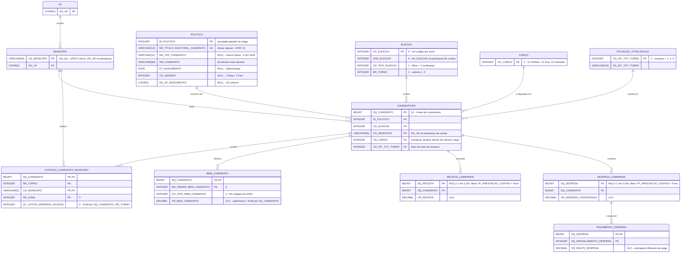

```mermaid
erDiagram
    %% ---- dimensoes ----
    UF                   ||--o{ MUNICIPIO   : "contem"
    POLITICO             ||--o{ CANDIDATURA : "concorre em"
    ELEICAO              ||--o{ CANDIDATURA : "contem"
    MUNICIPIO            ||--o{ CANDIDATURA : "sedia"
    CARGO                ||--o{ CANDIDATURA : "e disputado em"
    SITUACAO_TOTALIZACAO ||--o{ CANDIDATURA : "resulta em"

    %% ---- sucesso ----
    CANDIDATURA ||--o{ VOTACAO_CANDIDATO_MUNICIPIO : "recebe"
    MUNICIPIO   ||--o{ VOTACAO_CANDIDATO_MUNICIPIO : "totaliza"

    %% ---- dinheiro ----
    CANDIDATURA      ||--o{ BEM_CANDIDATO     : "declara"
    CANDIDATURA      ||--o{ RECEITA_CAMPANHA  : "arrecada"
    CANDIDATURA      ||--o{ DESPESA_CAMPANHA  : "contrata"
    DESPESA_CAMPANHA ||--o{ PAGAMENTO_DESPESA : "e paga por"

    ELEICAO {
        INTEGER CD_ELEICAO      PK "4 - um codigo por turno"
        INTEGER ANO_ELEICAO        "4 - AA_ELEICAO na prestacao de contas"
        INTEGER CD_TIPO_ELEICAO    "1 - filtrar = 2 (ordinaria)"
        INTEGER NR_TURNO           "1 - valores 1, 2"
    }

    UF {
        CHAR(2) SG_UF PK
    }

    MUNICIPIO {
        VARCHAR(5) CD_MUNICIPIO PK "cod_tse - LPAD 5 zeros; SG_UE na prestacao"
        CHAR(2)    SG_UF        FK
    }

    CARGO {
        INTEGER CD_CARGO PK "2 - 11 Prefeito, 12 Vice, 13 Vereador"
    }

    SITUACAO_TOTALIZACAO {
        INTEGER     CD_SIT_TOT_TURNO PK "1 - sucesso = 1, 2, 3"
        VARCHAR(16) DS_SIT_TOT_TURNO
    }

    POLITICO {
        INTEGER     ID_POLITICO                   PK "surrogate gerado na carga"
        VARCHAR(12) NR_TITULO_ELEITORAL_CANDIDATO UK "chave natural - LPAD 12"
        VARCHAR(11) NR_CPF_CANDIDATO                 "NULL - nunca chave; -4 em 2024"
        VARCHAR(69) NM_CANDIDATO                     "da eleicao mais recente"
        DATE        DT_NASCIMENTO                    "NULL - dd/mm/aaaa"
        INTEGER     CD_GENERO                        "NULL - 2 Masc, 4 Fem"
        CHAR(2)     SG_UF_NASCIMENTO                 "NULL - ZZ exterior"
    }

    CANDIDATURA {
        BIGINT     SQ_CANDIDATO     PK "12 - chave de cruzamento"
        INTEGER    ID_POLITICO      FK
        INTEGER    CD_ELEICAO       FK
        VARCHAR(5) CD_MUNICIPIO     FK "SG_UE na prestacao de contas"
        INTEGER    CD_CARGO         FK "comparar sempre dentro do mesmo cargo"
        INTEGER    CD_SIT_TOT_TURNO FK "base da taxa de sucesso"
    }

    VOTACAO_CANDIDATO_MUNICIPIO {
        BIGINT     SQ_CANDIDATO              PK, FK
        INTEGER    NR_TURNO                  PK
        VARCHAR(5) CD_MUNICIPIO              PK, FK
        INTEGER    NR_ZONA                   PK "3"
        INTEGER    QT_VOTOS_NOMINAIS_VALIDOS    "6 - SUM por SQ_CANDIDATO, NR_TURNO"
    }

    BEM_CANDIDATO {
        BIGINT  SQ_CANDIDATO           PK, FK
        INTEGER NR_ORDEM_BEM_CANDIDATO PK "3"
        INTEGER CD_TIPO_BEM_CANDIDATO     "2 - 50 codigos em 2024"
        DECIMAL VR_BEM_CANDIDATO          "15,2 - patrimonio = SUM por SQ_CANDIDATO"
    }

    RECEITA_CAMPANHA {
        BIGINT  SQ_RECEITA   PK "NULL/-1 em 3,3%; filtrar TP_PRESTACAO_CONTAS = Final"
        BIGINT  SQ_CANDIDATO FK
        DECIMAL VR_RECEITA      "15,2"
    }

    DESPESA_CAMPANHA {
        BIGINT  SQ_DESPESA            PK "NULL/-1 em 3,5%; filtrar TP_PRESTACAO_CONTAS = Final"
        BIGINT  SQ_CANDIDATO          FK
        DECIMAL VR_DESPESA_CONTRATADA    "15,2"
    }

    PAGAMENTO_DESPESA {
        BIGINT  SQ_DESPESA              PK, FK
        INTEGER SQ_PARCELAMENTO_DESPESA PK
        DECIMAL VR_PAGTO_DESPESA           "15,2 - contratado diferente de pago"
    }
```
