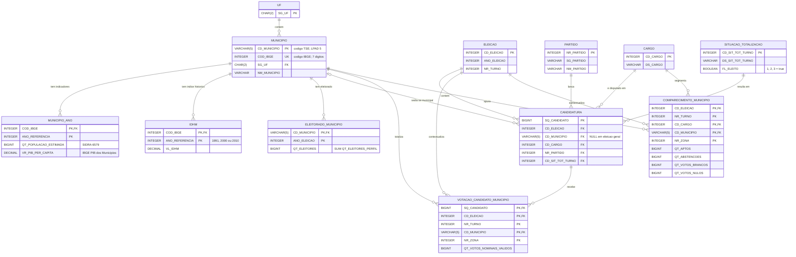

```mermaid
erDiagram
    UF        ||--o{ MUNICIPIO : "contem"
    MUNICIPIO ||--o{ MUNICIPIO_ANO : "tem indicadores"
    MUNICIPIO ||--o{ IDHM : "tem indice historico"
    MUNICIPIO ||--o{ ELEITORADO_MUNICIPIO : "tem eleitorado"

    ELEICAO              ||--o{ CANDIDATURA : "contem"
    PARTIDO              ||--o{ CANDIDATURA : "lanca"
    CARGO                ||--o{ CANDIDATURA : "e disputado em"
    SITUACAO_TOTALIZACAO ||--o{ CANDIDATURA : "resulta em"
    MUNICIPIO            o|--o{ CANDIDATURA : "sedia se municipal"

    CANDIDATURA ||--o{ VOTACAO_CANDIDATO_MUNICIPIO : "recebe"
    MUNICIPIO   ||--o{ VOTACAO_CANDIDATO_MUNICIPIO : "totaliza"
    ELEICAO     ||--o{ VOTACAO_CANDIDATO_MUNICIPIO : "contextualiza"

    MUNICIPIO ||--o{ COMPARECIMENTO_MUNICIPIO : "apura"
    ELEICAO   ||--o{ COMPARECIMENTO_MUNICIPIO : "contextualiza"
    CARGO     ||--o{ COMPARECIMENTO_MUNICIPIO : "segmenta"

    UF {
        CHAR(2) SG_UF PK
    }

    MUNICIPIO {
        VARCHAR(5) CD_MUNICIPIO PK "codigo TSE; LPAD 5"
        INTEGER    COD_IBGE     UK "codigo IBGE; 7 digitos"
        CHAR(2)    SG_UF        FK
        VARCHAR    NM_MUNICIPIO
    }

    MUNICIPIO_ANO {
        INTEGER COD_IBGE             PK, FK
        INTEGER ANO_REFERENCIA       PK
        BIGINT  QT_POPULACAO_ESTIMADA   "SIDRA 6579"
        DECIMAL VR_PIB_PER_CAPITA       "IBGE PIB dos Municipios"
    }

    IDHM {
        INTEGER COD_IBGE       PK, FK
        INTEGER ANO_REFERENCIA PK "1991, 2000 ou 2010"
        DECIMAL VL_IDHM
    }

    ELEITORADO_MUNICIPIO {
        VARCHAR(5) CD_MUNICIPIO PK, FK
        INTEGER    ANO_ELEICAO  PK
        BIGINT     QT_ELEITORES    "SUM QT_ELEITORES_PERFIL"
    }

    ELEICAO {
        INTEGER CD_ELEICAO PK
        INTEGER ANO_ELEICAO
        INTEGER NR_TURNO
    }

    CARGO {
        INTEGER CD_CARGO PK
        VARCHAR DS_CARGO
    }

    PARTIDO {
        INTEGER NR_PARTIDO PK
        VARCHAR SG_PARTIDO
        VARCHAR NM_PARTIDO
    }

    SITUACAO_TOTALIZACAO {
        INTEGER CD_SIT_TOT_TURNO PK
        VARCHAR DS_SIT_TOT_TURNO
        BOOLEAN FL_ELEITO           "1, 2, 3 = true"
    }

    CANDIDATURA {
        BIGINT     SQ_CANDIDATO     PK
        INTEGER    CD_ELEICAO       FK
        VARCHAR(5) CD_MUNICIPIO     FK "NULL em eleicao geral"
        INTEGER    CD_CARGO         FK
        INTEGER    NR_PARTIDO       FK
        INTEGER    CD_SIT_TOT_TURNO FK
    }

    VOTACAO_CANDIDATO_MUNICIPIO {
        BIGINT     SQ_CANDIDATO PK, FK
        INTEGER    CD_ELEICAO   PK, FK
        INTEGER    NR_TURNO     PK
        VARCHAR(5) CD_MUNICIPIO PK, FK
        INTEGER    NR_ZONA      PK
        BIGINT     QT_VOTOS_NOMINAIS_VALIDOS
    }

    COMPARECIMENTO_MUNICIPIO {
        INTEGER    CD_ELEICAO       PK, FK
        INTEGER    NR_TURNO         PK
        INTEGER    CD_CARGO         PK, FK
        VARCHAR(5) CD_MUNICIPIO     PK, FK
        INTEGER    NR_ZONA          PK
        BIGINT     QT_APTOS
        BIGINT     QT_ABSTENCOES
        BIGINT     QT_VOTOS_BRANCOS
        BIGINT     QT_VOTOS_NULOS
    }
```
