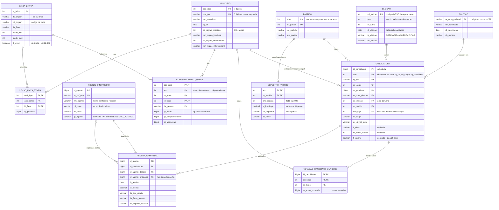

```mermaid
erDiagram
    POLITICO          ||--o{ CANDIDATURA                 : "concorre em"
    ELEICAO           ||--o{ CANDIDATURA                 : "contem"
    PARTIDO           ||--o{ CANDIDATURA                 : "lanca"
    MUNICIPIO         |o--o{ CANDIDATURA                 : "sedia (so eleicao municipal)"

    CANDIDATURA       ||--o{ VOTACAO_CANDIDATO_MUNICIPIO : "recebe votos"
    MUNICIPIO         ||--o{ VOTACAO_CANDIDATO_MUNICIPIO : "apura"

    CANDIDATURA       ||--o{ RECEITA_CAMPANHA            : "arrecada"
    AGENTE_FINANCEIRO ||--o{ RECEITA_CAMPANHA            : "doa direto"
    AGENTE_FINANCEIRO |o--o{ RECEITA_CAMPANHA            : "origina via partido"

    MUNICIPIO         ||--o{ COMPARECIMENTO_PERFIL       : "tem"
    FAIXA_ETARIA      ||--o{ COMPARECIMENTO_PERFIL       : "classifica"

    MUNICIPIO         ||--o{ CENSO_FAIXA_ETARIA          : "tem"
    FAIXA_ETARIA      ||--o{ CENSO_FAIXA_ETARIA          : "classifica"

    PARTIDO           ||--o| ESPECTRO_PARTIDO            : "classificado como"

    MUNICIPIO {
        int     cod_ibge PK "7 digitos"
        varchar cod_tse UK "5 digitos, zero a esquerda"
        varchar nm_municipio
        char    sg_uf
        int     cd_regiao_imediata "Q9 - regiao"
        varchar nm_regiao_imediata
        int     cd_regiao_intermediaria
        varchar nm_regiao_intermediaria
    }
    ELEICAO {
        int     cd_eleicao PK "codigo do TSE, ja separa turno"
        int     ano "ano do pleito, nao da votacao"
        int     nr_turno
        date    dt_eleicao "data real da votacao"
        varchar tp_eleicao "ORDINARIA ou SUPLEMENTAR"
        varchar ds_eleicao
    }
    PARTIDO {
        int     ano PK "numero e reaproveitado entre anos"
        int     nr_partido PK
        varchar sg_partido
        varchar nm_partido
    }
    ESPECTRO_PARTIDO {
        int     ano PK, FK
        int     nr_partido PK, FK
        int     ano_rodada "2018 ou 2022"
        decimal vl_ideologia "escala de 11 pontos"
        varchar cd_espectro "5 categorias"
        varchar ds_fonte
    }
    POLITICO {
        varchar nr_titulo_eleitoral PK "12 digitos - nunca o CPF"
        varchar nm_candidato
        date    dt_nascimento
        varchar ds_genero
    }
    CANDIDATURA {
        bigint  id_candidatura PK "substituta"
        int     ano UK "chave natural: ano, sg_ue, cd_cargo, sq_candidato"
        varchar sg_ue UK
        int     cd_cargo UK
        bigint  sq_candidato UK
        varchar nr_titulo_eleitoral FK
        int     cd_eleicao FK "a do 1o turno"
        int     nr_partido FK
        int     cod_ibge FK "nulo fora de eleicao municipal"
        varchar ds_cargo
        varchar ds_sit_tot_turno
        boolean fl_eleito "derivada"
        int     nr_idade_eleicao "derivada"
        boolean fl_jovem "derivada - 15 a 29 anos"
    }
    VOTACAO_CANDIDATO_MUNICIPIO {
        bigint  id_candidatura PK, FK
        int     cod_ibge PK, FK
        int     nr_turno PK
        bigint  qt_votos_nominais "zonas somadas"
    }
    AGENTE_FINANCEIRO {
        bigint  id_agente PK
        varchar nr_cpf_cnpj UK
        varchar nm_agente "nome na Receita Federal"
        varchar cd_cnae "so no doador direto"
        varchar ds_cnae
        varchar tp_agente "derivada - PF, EMPRESA ou ORG_POLITICA"
    }
    RECEITA_CAMPANHA {
        bigint  id_receita PK
        bigint  id_candidatura FK
        bigint  id_agente_doador FK
        bigint  id_agente_originario FK "nulo quando nao ha"
        date    dt_receita
        decimal vr_receita
        varchar ds_tipo_receita
        varchar ds_fonte_recurso
        varchar ds_especie_recurso
    }
    FAIXA_ETARIA {
        int     id_faixa PK
        varchar ds_origem "TSE ou IBGE"
        varchar cd_origem "codigo na fonte"
        varchar ds_faixa
        int     idade_min
        int     idade_max
        boolean fl_jovem "derivada - Lei 12.852"
    }
    COMPARECIMENTO_PERFIL {
        int     cod_ibge PK, FK
        int     ano PK "o arquivo nao tem codigo de eleicao"
        int     nr_turno PK
        int     id_faixa PK, FK
        varchar ds_genero PK
        bigint  qt_aptos "igual ao eleitorado"
        bigint  qt_comparecimento
        bigint  qt_abstencao
    }
    CENSO_FAIXA_ETARIA {
        int     cod_ibge PK, FK
        int     ano_censo PK
        int     id_faixa PK, FK
        bigint  qt_pessoas
    }
```
