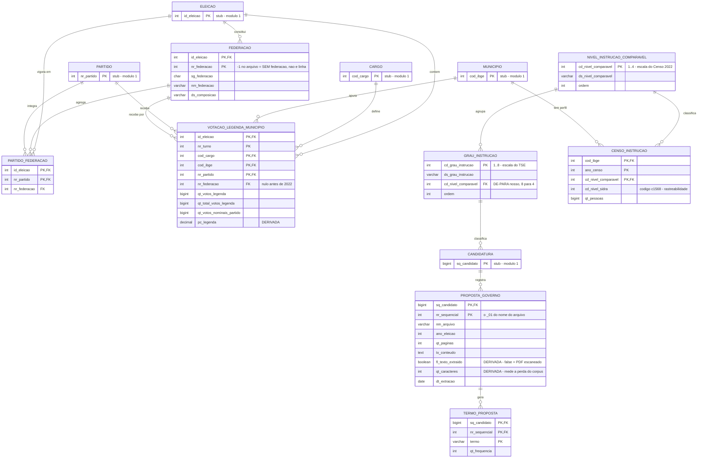

```mermaid
erDiagram
    ELEICAO   ||--o{ FEDERACAO                  : "constitui"
    ELEICAO   ||--o{ PARTIDO_FEDERACAO          : "vigora em"
    FEDERACAO ||--o{ PARTIDO_FEDERACAO          : "agrega"
    PARTIDO   ||--o{ PARTIDO_FEDERACAO          : "integra"

    ELEICAO   ||--o{ VOTACAO_LEGENDA_MUNICIPIO  : "contem"
    CARGO     ||--o{ VOTACAO_LEGENDA_MUNICIPIO  : "define"
    MUNICIPIO ||--o{ VOTACAO_LEGENDA_MUNICIPIO  : "apura"
    PARTIDO   ||--o{ VOTACAO_LEGENDA_MUNICIPIO  : "recebe"
    FEDERACAO ||--o{ VOTACAO_LEGENDA_MUNICIPIO  : "recebe por"

    NIVEL_INSTRUCAO_COMPARAVEL ||--o{ GRAU_INSTRUCAO  : "agrupa"
    NIVEL_INSTRUCAO_COMPARAVEL ||--o{ CENSO_INSTRUCAO : "classifica"
    GRAU_INSTRUCAO ||--o{ CANDIDATURA     : "classifica"
    MUNICIPIO      ||--o{ CENSO_INSTRUCAO : "tem perfil"

    CANDIDATURA      ||--o{ PROPOSTA_GOVERNO : "registra"
    PROPOSTA_GOVERNO ||--o{ TERMO_PROPOSTA   : "gera"

    MUNICIPIO {
        int cod_ibge PK "stub - modulo 1"
    }
    PARTIDO {
        int nr_partido PK "stub - modulo 1"
    }
    ELEICAO {
        int id_eleicao PK "stub - modulo 1"
    }
    CARGO {
        int cod_cargo PK "stub - modulo 1"
    }
    CANDIDATURA {
        bigint sq_candidato PK "stub - modulo 1"
    }

    FEDERACAO {
        int id_eleicao PK, FK
        int nr_federacao PK "-1 no arquivo = SEM federacao, nao e linha"
        char sg_federacao
        varchar nm_federacao
        varchar ds_composicao
    }
    PARTIDO_FEDERACAO {
        int id_eleicao PK, FK
        int nr_partido PK, FK
        int nr_federacao FK
    }
    VOTACAO_LEGENDA_MUNICIPIO {
        int id_eleicao PK, FK
        int nr_turno PK
        int cod_cargo PK, FK
        int cod_ibge PK, FK
        int nr_partido PK, FK
        int nr_federacao FK "nulo antes de 2022"
        bigint qt_votos_legenda
        bigint qt_total_votos_legenda
        bigint qt_votos_nominais_partido
        decimal pc_legenda "DERIVADA"
    }
    NIVEL_INSTRUCAO_COMPARAVEL {
        int cd_nivel_comparavel PK "1..4 - escala do Censo 2022"
        varchar ds_nivel_comparavel
        int ordem
    }
    GRAU_INSTRUCAO {
        int cd_grau_instrucao PK "1..8 - escala do TSE"
        varchar ds_grau_instrucao
        int cd_nivel_comparavel FK "DE-PARA nosso, 8 para 4"
        int ordem
    }
    CENSO_INSTRUCAO {
        int cod_ibge PK, FK
        int ano_censo PK
        int cd_nivel_comparavel PK, FK
        int cd_nivel_sidra "codigo c1568 - rastreabilidade"
        bigint qt_pessoas
    }
    PROPOSTA_GOVERNO {
        bigint sq_candidato PK, FK
        int nr_sequencial PK "o _01 do nome do arquivo"
        varchar nm_arquivo
        int ano_eleicao
        int qt_paginas
        text tx_conteudo
        boolean fl_texto_extraido "DERIVADA - false = PDF escaneado"
        int qt_caracteres "DERIVADA - mede a perda do corpus"
        date dt_extracao
    }
    TERMO_PROPOSTA {
        bigint sq_candidato PK, FK
        int nr_sequencial PK, FK
        varchar termo PK
        int qt_frequencia
    }
```
