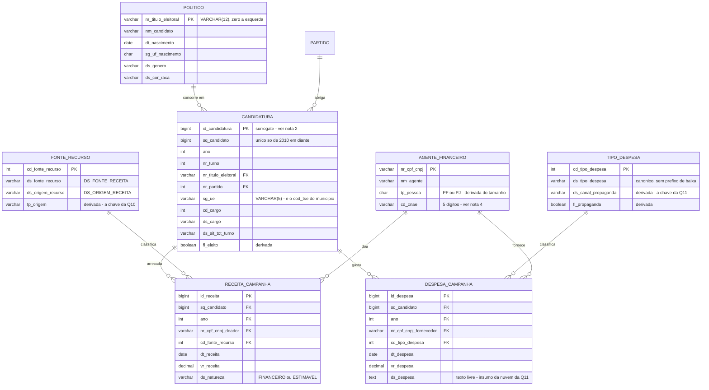

```mermaid
erDiagram
    POLITICO          ||--o{ CANDIDATURA       : "concorre em"
    CANDIDATURA       ||--o{ RECEITA_CAMPANHA  : "arrecada"
    CANDIDATURA       ||--o{ DESPESA_CAMPANHA  : "gasta"
    FONTE_RECURSO     ||--o{ RECEITA_CAMPANHA  : "classifica"
    TIPO_DESPESA      ||--o{ DESPESA_CAMPANHA  : "classifica"
    AGENTE_FINANCEIRO ||--o{ RECEITA_CAMPANHA  : "doa"
    AGENTE_FINANCEIRO ||--o{ DESPESA_CAMPANHA  : "fornece"
    PARTIDO           ||--o{ CANDIDATURA       : "abriga"

    POLITICO {
        varchar nr_titulo_eleitoral PK "VARCHAR(12), zero a esquerda"
        varchar nm_candidato
        date    dt_nascimento
        char    sg_uf_nascimento
        varchar ds_genero
        varchar ds_cor_raca
    }

    CANDIDATURA {
        bigint  id_candidatura PK "surrogate - ver nota 2"
        bigint  sq_candidato "unico so de 2010 em diante"
        int     ano
        int     nr_turno
        varchar nr_titulo_eleitoral FK
        int     nr_partido FK
        varchar sg_ue "VARCHAR(5) - e o cod_tse do municipio"
        int     cd_cargo
        varchar ds_cargo
        varchar ds_sit_tot_turno
        boolean fl_eleito "derivada"
    }

    FONTE_RECURSO {
        int     cd_fonte_recurso PK
        varchar ds_fonte_recurso "DS_FONTE_RECEITA"
        varchar ds_origem_recurso "DS_ORIGEM_RECEITA"
        varchar tp_origem "derivada - a chave da Q10"
    }

    TIPO_DESPESA {
        int     cd_tipo_despesa PK
        varchar ds_tipo_despesa "canonico, sem prefixo de baixa"
        varchar ds_canal_propaganda "derivada - a chave da Q11"
        boolean fl_propaganda "derivada"
    }

    AGENTE_FINANCEIRO {
        varchar nr_cpf_cnpj PK
        varchar nm_agente
        char    tp_pessoa "PF ou PJ - derivada do tamanho"
        varchar cd_cnae "5 digitos - ver nota 4"
    }

    RECEITA_CAMPANHA {
        bigint  id_receita PK
        bigint  sq_candidato FK
        int     ano FK
        varchar nr_cpf_cnpj_doador FK
        int     cd_fonte_recurso FK
        date    dt_receita
        decimal vr_receita
        varchar ds_natureza "FINANCEIRO ou ESTIMAVEL"
    }

    DESPESA_CAMPANHA {
        bigint  id_despesa PK
        bigint  sq_candidato FK
        int     ano FK
        varchar nr_cpf_cnpj_fornecedor FK
        int     cd_tipo_despesa FK
        date    dt_despesa
        decimal vr_despesa
        text    ds_despesa "texto livre - insumo da nuvem da Q11"
    }
```
