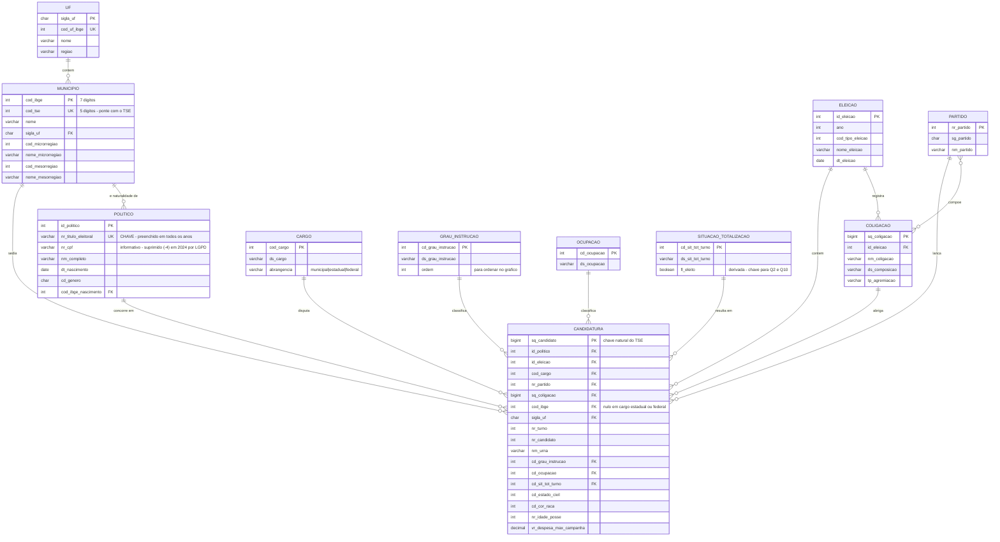

```mermaid
erDiagram
    UF ||--o{ MUNICIPIO : "contem"
    MUNICIPIO ||--o{ CANDIDATURA : "sedia"
    MUNICIPIO ||--o{ POLITICO : "e naturalidade de"
    ELEICAO ||--o{ CANDIDATURA : "contem"
    ELEICAO ||--o{ COLIGACAO : "registra"
    CARGO ||--o{ CANDIDATURA : "disputa"
    PARTIDO ||--o{ CANDIDATURA : "lanca"
    PARTIDO }o--o{ COLIGACAO : "compoe"
    COLIGACAO ||--o{ CANDIDATURA : "abriga"
    POLITICO ||--o{ CANDIDATURA : "concorre em"
    GRAU_INSTRUCAO ||--o{ CANDIDATURA : "classifica"
    OCUPACAO ||--o{ CANDIDATURA : "classifica"
    SITUACAO_TOTALIZACAO ||--o{ CANDIDATURA : "resulta em"

    UF {
        char sigla_uf PK
        int cod_uf_ibge UK
        varchar nome
        varchar regiao
    }
    MUNICIPIO {
        int cod_ibge PK "7 digitos"
        int cod_tse UK "5 digitos - ponte com o TSE"
        varchar nome
        char sigla_uf FK
        int cod_microrregiao
        varchar nome_microrregiao
        int cod_mesorregiao
        varchar nome_mesorregiao
    }
    ELEICAO {
        int id_eleicao PK
        int ano
        int cod_tipo_eleicao
        varchar nome_eleicao
        date dt_eleicao
    }
    CARGO {
        int cod_cargo PK
        varchar ds_cargo
        varchar abrangencia "municipal|estadual|federal"
    }
    PARTIDO {
        int nr_partido PK
        char sg_partido
        varchar nm_partido
    }
    COLIGACAO {
        bigint sq_coligacao PK
        int id_eleicao FK
        varchar nm_coligacao
        varchar ds_composicao
        varchar tp_agremiacao
    }
    POLITICO {
        int id_politico PK
        varchar nr_titulo_eleitoral UK "CHAVE - preenchido em todos os anos"
        varchar nr_cpf "informativo - suprimido (-4) em 2024 por LGPD"
        varchar nm_completo
        date dt_nascimento
        char cd_genero
        int cod_ibge_nascimento FK
    }
    CANDIDATURA {
        bigint sq_candidato PK "chave natural do TSE"
        int id_politico FK
        int id_eleicao FK
        int cod_cargo FK
        int nr_partido FK
        bigint sq_coligacao FK
        int cod_ibge FK "nulo em cargo estadual ou federal"
        char sigla_uf FK
        int nr_turno
        int nr_candidato
        varchar nm_urna
        int cd_grau_instrucao FK
        int cd_ocupacao FK
        int cd_sit_tot_turno FK
        int cd_estado_civil
        int cd_cor_raca
        int nr_idade_posse
        decimal vr_despesa_max_campanha
    }
    GRAU_INSTRUCAO {
        int cd_grau_instrucao PK
        varchar ds_grau_instrucao
        int ordem "para ordenar no grafico"
    }
    OCUPACAO {
        int cd_ocupacao PK
        varchar ds_ocupacao
    }
    SITUACAO_TOTALIZACAO {
        int cd_sit_tot_turno PK
        varchar ds_sit_tot_turno
        boolean fl_eleito "derivada - chave para Q2 e Q10"
    }
```
