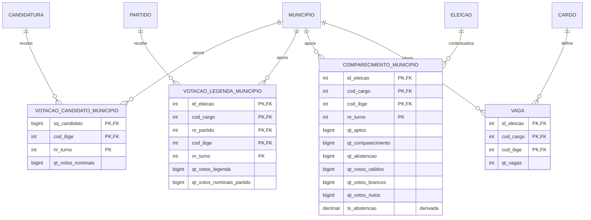

```mermaid
erDiagram
    CANDIDATURA ||--o{ VOTACAO_CANDIDATO_MUNICIPIO : "recebe"
    MUNICIPIO   ||--o{ VOTACAO_CANDIDATO_MUNICIPIO : "apura"
    MUNICIPIO   ||--o{ VOTACAO_LEGENDA_MUNICIPIO   : "apura"
    MUNICIPIO   ||--o{ COMPARECIMENTO_MUNICIPIO    : "apura"
    MUNICIPIO   ||--o{ VAGA                        : "oferta"
    PARTIDO     ||--o{ VOTACAO_LEGENDA_MUNICIPIO   : "recebe"
    ELEICAO     ||--o{ COMPARECIMENTO_MUNICIPIO    : "contextualiza"
    CARGO       ||--o{ VAGA                        : "define"

    VOTACAO_CANDIDATO_MUNICIPIO {
        bigint sq_candidato PK, FK
        int cod_ibge PK, FK
        int nr_turno PK
        bigint qt_votos_nominais
    }
    VOTACAO_LEGENDA_MUNICIPIO {
        int id_eleicao PK, FK
        int cod_cargo PK, FK
        int nr_partido PK, FK
        int cod_ibge PK, FK
        int nr_turno PK
        bigint qt_votos_legenda
        bigint qt_votos_nominais_partido
    }
    COMPARECIMENTO_MUNICIPIO {
        int id_eleicao PK, FK
        int cod_cargo PK, FK
        int cod_ibge PK, FK
        int nr_turno PK
        bigint qt_aptos
        bigint qt_comparecimento
        bigint qt_abstencao
        bigint qt_votos_validos
        bigint qt_votos_brancos
        bigint qt_votos_nulos
        decimal tx_abstencao "derivada"
    }
    VAGA {
        int id_eleicao PK, FK
        int cod_cargo PK, FK
        int cod_ibge PK, FK
        int qt_vagas
    }
```
