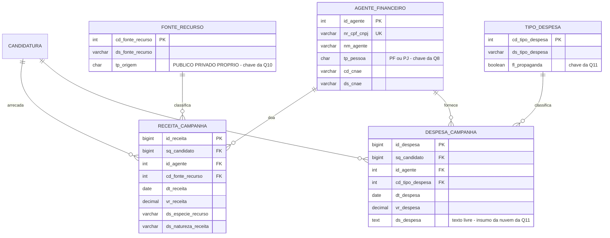

```mermaid
erDiagram
    CANDIDATURA       ||--o{ RECEITA_CAMPANHA : "arrecada"
    CANDIDATURA       ||--o{ DESPESA_CAMPANHA : "gasta"
    AGENTE_FINANCEIRO ||--o{ RECEITA_CAMPANHA : "doa"
    AGENTE_FINANCEIRO ||--o{ DESPESA_CAMPANHA : "fornece"
    FONTE_RECURSO     ||--o{ RECEITA_CAMPANHA : "classifica"
    TIPO_DESPESA      ||--o{ DESPESA_CAMPANHA : "classifica"

    AGENTE_FINANCEIRO {
        int id_agente PK
        varchar nr_cpf_cnpj UK
        varchar nm_agente
        char tp_pessoa "PF ou PJ - chave da Q8"
        varchar cd_cnae
        varchar ds_cnae
    }
    FONTE_RECURSO {
        int cd_fonte_recurso PK
        varchar ds_fonte_recurso
        char tp_origem "PUBLICO PRIVADO PROPRIO - chave da Q10"
    }
    TIPO_DESPESA {
        int cd_tipo_despesa PK
        varchar ds_tipo_despesa
        boolean fl_propaganda "chave da Q11"
    }
    RECEITA_CAMPANHA {
        bigint id_receita PK
        bigint sq_candidato FK
        int id_agente FK
        int cd_fonte_recurso FK
        date dt_receita
        decimal vr_receita
        varchar ds_especie_recurso
        varchar ds_natureza_receita
    }
    DESPESA_CAMPANHA {
        bigint id_despesa PK
        bigint sq_candidato FK
        int id_agente FK
        int cd_tipo_despesa FK
        date dt_despesa
        decimal vr_despesa
        text ds_despesa "texto livre - insumo da nuvem da Q11"
    }
```
