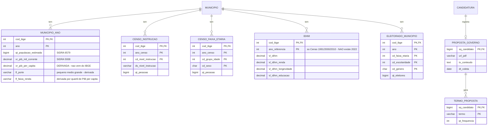

```mermaid
erDiagram
    MUNICIPIO ||--o{ MUNICIPIO_ANO        : "tem"
    MUNICIPIO ||--o{ CENSO_INSTRUCAO      : "tem"
    MUNICIPIO ||--o{ CENSO_FAIXA_ETARIA   : "tem"
    MUNICIPIO ||--o{ IDHM                 : "tem"
    MUNICIPIO ||--o{ ELEITORADO_MUNICIPIO : "tem"
    CANDIDATURA ||--o| PROPOSTA_GOVERNO   : "registra"
    PROPOSTA_GOVERNO ||--o{ TERMO_PROPOSTA : "gera"

    MUNICIPIO_ANO {
        int cod_ibge PK, FK
        int ano PK
        bigint qt_populacao_estimada "SIDRA 6579"
        decimal vr_pib_mil_corrente "SIDRA 5938"
        decimal vr_pib_per_capita "DERIVADA - nao vem do IBGE"
        varchar fl_porte "pequeno medio grande - derivada"
        varchar fl_faixa_renda "derivada por quartil de PIB per capita"
    }
    CENSO_INSTRUCAO {
        int cod_ibge PK, FK
        int ano_censo PK
        int cd_nivel_instrucao PK
        varchar ds_nivel_instrucao
        bigint qt_pessoas
    }
    CENSO_FAIXA_ETARIA {
        int cod_ibge PK, FK
        int ano_censo PK
        int cd_grupo_idade PK
        char cd_sexo PK
        bigint qt_pessoas
    }
    IDHM {
        int cod_ibge PK, FK
        int ano_referencia PK "so Censo 1991/2000/2010 - NAO existe 2022"
        decimal vl_idhm
        decimal vl_idhm_renda
        decimal vl_idhm_longevidade
        decimal vl_idhm_educacao
    }
    ELEITORADO_MUNICIPIO {
        int cod_ibge PK, FK
        int ano PK
        int cd_faixa_etaria PK
        int cd_escolaridade PK
        char cd_genero PK
        bigint qt_eleitores
    }
    PROPOSTA_GOVERNO {
        bigint sq_candidato PK, FK
        varchar url_pdf
        text tx_conteudo
        date dt_coleta
    }
    TERMO_PROPOSTA {
        bigint sq_candidato PK, FK
        varchar termo PK
        int qt_frequencia
    }
```
