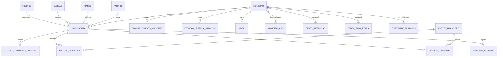

```mermaid
erDiagram
    POLITICO       ||--o{ CANDIDATURA : "concorre em"
    ELEICAO        ||--o{ CANDIDATURA : "contem"
    CARGO          ||--o{ CANDIDATURA : "disputa"
    PARTIDO        ||--o{ CANDIDATURA : "lanca"
    MUNICIPIO      ||--o{ CANDIDATURA : "sedia"

    CANDIDATURA    ||--o{ VOTACAO_CANDIDATO_MUNICIPIO : "recebe"
    CANDIDATURA    ||--o{ RECEITA_CAMPANHA           : "arrecada"
    CANDIDATURA    ||--o{ DESPESA_CAMPANHA           : "gasta"
    CANDIDATURA    ||--o| PROPOSTA_GOVERNO           : "registra"

    MUNICIPIO      ||--o{ COMPARECIMENTO_MUNICIPIO   : "apura"
    MUNICIPIO      ||--o{ VOTACAO_LEGENDA_MUNICIPIO  : "apura"
    MUNICIPIO      ||--o{ VAGA                       : "oferta"
    MUNICIPIO      ||--o{ MUNICIPIO_ANO              : "tem indicador"
    MUNICIPIO      ||--o{ CENSO_INSTRUCAO            : "tem perfil"
    MUNICIPIO      ||--o{ CENSO_FAIXA_ETARIA         : "tem perfil"
    MUNICIPIO      ||--o{ ELEITORADO_MUNICIPIO       : "tem eleitorado"

    AGENTE_FINANCEIRO ||--o{ RECEITA_CAMPANHA : "doa"
    AGENTE_FINANCEIRO ||--o{ DESPESA_CAMPANHA : "fornece"
```
